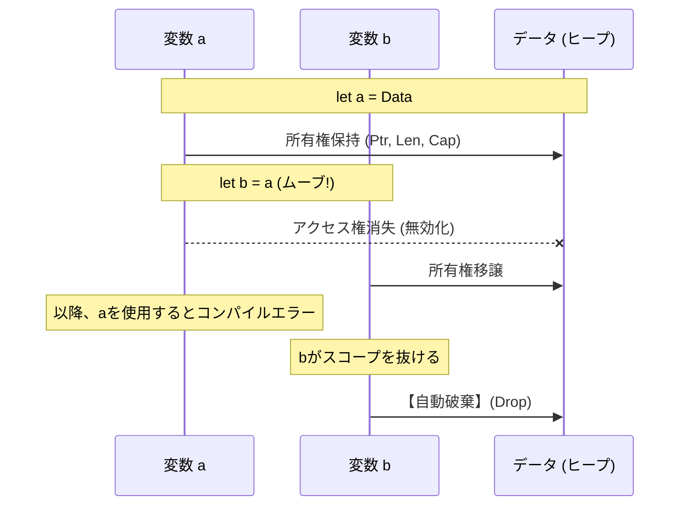
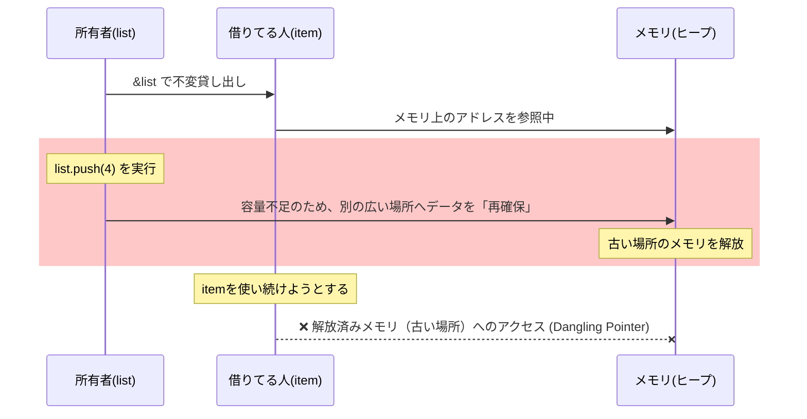

# Rust 01: Core Concepts - Ownership & Borrowing

- [Rust 01: Core Concepts - Ownership \& Borrowing](#rust-01-core-concepts---ownership--borrowing)
  - [Overview](#overview)
  - [Key Terms](#key-terms)
  - [Ownership: The Foundation of Static Memory Management](#ownership-the-foundation-of-static-memory-management)
    - [1. Owner's Responsibility: Preventing Double Freeing of Memory](#1-owners-responsibility-preventing-double-freeing-of-memory)
    - [2. Comparison with Other Languages: GC vs Ownership](#2-comparison-with-other-languages-gc-vs-ownership)
    - [3. The Mechanism of Transfer (Move)](#3-the-mechanism-of-transfer-move)
  - [Borrowing: Secure Data Sharing](#borrowing-secure-data-sharing)
    - [1. The Golden Rule of Borrowing (Borrowing Rules)](#1-the-golden-rule-of-borrowing-borrowing-rules)
    - [2. The Physical Background of Typical Compilation Errors](#2-the-physical-background-of-typical-compilation-errors)
  - [Comparison with Other Languages](#comparison-with-other-languages)

## Overview

Rustは「安全性（Safety）」「並行性（Concurrency）」「性能（Performance）」の3つを同時に満たすことを目的としたシステムプログラミング言語です。その核となるのが **「所有権（Ownership）」** と **「借用（Borrowing）」** という概念です。これらはコンパイラによる静的解析であり、実行時のオーバーヘッド（GCの停止など）なしでメモリ安全を実現します。

## Key Terms

- **Ownership (所有権)**: 値の寿命を管理する権限。
- **Borrowing (借用)**: 所有権を移さず、一時的に参照権を得ること。
- **Borrow Checker**: コンパイル時に参照の有効性と安全性を検証するプログラム。

## Ownership: The Foundation of Static Memory Management

### 1. Owner's Responsibility: Preventing Double Freeing of Memory

Rustでは、ヒープ上のデータに対して **「所有者」は常に1人** です。

- **RAIIの徹底**: 所有者がスコープを抜ける際、Rustは自動的に `drop` 関数を呼び出し、メモリを解放します。
- **二重解放の防止**: 所有者が1人であれば、同じメモリを2回解放してプログラムがクラッシュ（Double Free）する危険が物理的に排除されます。

### 2. Comparison with Other Languages: GC vs Ownership

JavaやPythonなどのGC言語には明確な「所有者」がいません。

- **GC言語**: 複数の変数が1つのデータを共有し、誰が最後に捨てるかはランタイム（GC）が判断します。
- **Rust**: データの飼い主（変数）を1人に限定し、その飼い主が死ぬ瞬間にデータを破棄します。

### 3. The Mechanism of Transfer (Move)

変数 `a` を `b` に代入すると、所有権が移動（ムーブ）します。

## Borrowing: Secure Data Sharing

「レンタル」に相当する借用は、ポインタのエイリアシングによるバグを静的に防ぎます。

### 1. The Golden Rule of Borrowing (Borrowing Rules)

借用チェッカーは以下のルールを厳格に適用します：

1. **不変参照 (`&T`)**: 読み取り専用。同時に何人でも貸し出せる。
2. **可変参照 (`&mut T`)**: 読み書き可能。**唯一無二**である必要がある（他人が読んでいる間も書き換え不可）。

> **論理**: 「書いている間に読まれる」「複数の場所から同時に書き換えられる」ことで発生するデータ競合をコンパイル時に阻止します。

### 2. The Physical Background of Typical Compilation Errors

なぜ「貸している最中の書き換え」が危険なのか、メモリの動きを追うと理屈が見えます。

## Comparison with Other Languages

| 特徴 | C / C++ | GC言語 (Java/Python) | Rust |
| --- | --- | --- | --- |
| **メモリ管理** | 手動 (malloc/free) | 自動 (GC) | **自動 (所有権システム)** |
| **安全性** | 危険 (UB/クラッシュ) | 高い | **極めて高い** |
| **実行速度** | 最速 | 低下 (GC停止時間) | **最速 (ゼロコスト抽象化)** |
| **バグ発見** | 実行時 (デバッグ) | 実行時 | **コンパイル時** |
