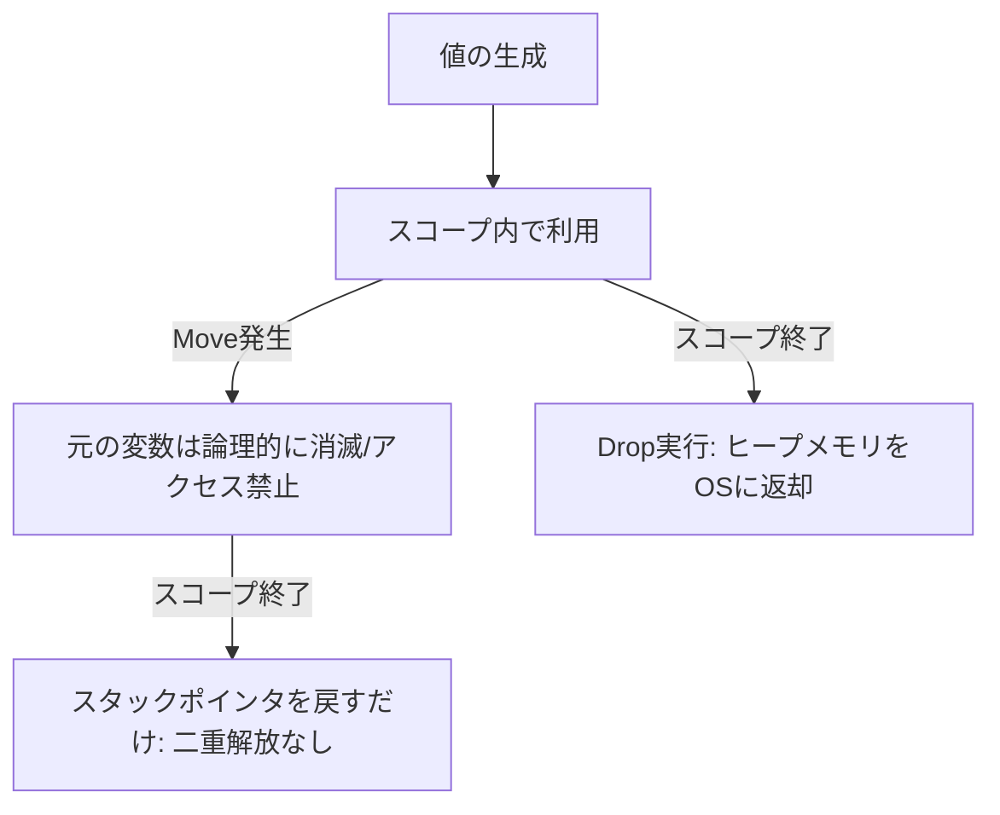

# Rust 04: Ownership

- [Rust 04: Ownership](#rust-04-ownership)
  - [Overview](#overview)
  - [Key Terms](#key-terms)
  - [Concise Explanation: The Rules of Ownership](#concise-explanation-the-rules-of-ownership)
  - [Deep Dive: Move vs Copy](#deep-dive-move-vs-copy)
  - [Memory Management: Stack vs Heap](#memory-management-stack-vs-heap)
  - [Code Example: Ownership Flow](#code-example-ownership-flow)
  - [Comparison: Memory Management Strategies](#comparison-memory-management-strategies)

## Overview

所有権（Ownership）は、ガベージコレクタ（GC）を使わずにメモリ安全性を保証するRust独自の仕組みです。コンパイル時に「誰がどのメモリに責任を持つか」を確定させるため、実行時のオーバーヘッド（Stop-the-world）なしでメモリリークを防ぎます。

## Key Terms

- **Move (ムーブ)**: 所有権を別の変数へ譲渡する。
- **Copy (コピー)**: 値を複製する。スタック上の固定サイズデータ（`i32`等）に適用される。
- **Drop (ドロップ)**: 変数がスコープを抜ける際、ヒープメモリを解放する自動プロセス（デストラクタ）。

## Concise Explanation: The Rules of Ownership

Rustのメモリ管理を支配する3つの鉄則があります：

1. Rustの各値は、**所有者**と呼ばれる変数と対応している。
2. いかなる時も、所有者は**ただ一人**である。
3. 所有者がスコープから外れたら、値は**自動的に破棄**される。

## Deep Dive: Move vs Copy

メモリの観点から見ると、挙動の違いが明確になります。

- **Move**: ヒープ領域のデータはそのままに、スタック上の「ポインタ情報（住所）」だけが移ります。
  - **物理的実態**: 移動元の変数にもビット列は残っているが、コンパイラが「使用禁止」の付箋を貼るため、アクセスは不可能。
  - **安全性**: 元の変数を無効化することで、二重解放（Double Free）を物理的に防ぎます。
- **Copy**: `Copy`トレイトを実装した型（整数、bool等）は、代入時にビット単位で複製されます。これは「住所」ではなく「値そのもの」が小さいため、自動コピーしても低コストだからです。

## Memory Management: Stack vs Heap

変数がスコープの末尾（`}`）に達した際の動きは、データの場所によって異なります。

1. **Stack (スタック)**: CPUの「スタックポインタ」を戻すだけ。物理的な消去はせず、「ここから先は空き地」と印を付け替えるだけなので爆速。
2. **Heap (ヒープ)**: そのデータを所有している変数がスコープを抜けるときのみ、`drop` 関数が呼ばれ、OSにメモリを返却する。



## Code Example: Ownership Flow

```rust
fn main() {
    let s1 = String::from("hello"); // s1がヒープの掃除当番（所有者）になる
    let s2 = s1;                   // 所有権がs2へムーブ（s1は論理的な廃墟になる）

    // println!("{}", s1);         // ❌ コンパイルエラー: 帳簿上 s1 は使用禁止

    let x = 5;                     // x (i32) は Copyトレイト持ち
    let y = x;                     // スタック上で値が複製される（免罪符）
    println!("x: {}, y: {}", x, y); // ✅ コピーなので両方使える

} // ここでs2のDropが呼ばれ、ヒープメモリが解放される。
  // その後、スタックポインタが戻り、s1, s2, x, y の領域がまとめて「空き地」になる。

```

## Comparison: Memory Management Strategies

| 特徴 | GC言語 (Java/Python) | マニュアル管理 (C/C++) | Rust (所有権) |
| --- | --- | --- | --- |
| **解放タイミング** | 実行時の任意のタイミング | プログラマが指定 | **コンパイル時に確定** |
| **実行時コスト** | GCの停止（オーバーヘッド）あり | 低いがミスに弱い | **ゼロ (ポインタ操作のみ)** |
| **安全性** | 高い | 低い（メモリリークの危険） | **極めて高い** |
