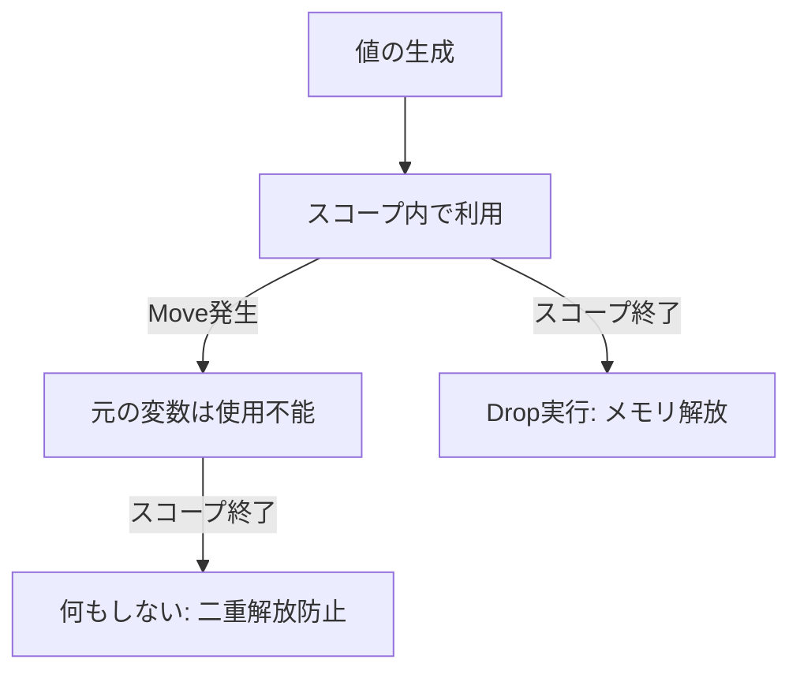

# Rust 04: Ownership (所有権)

- [Rust 04: Ownership (所有権)](#rust-04-ownership-所有権)
  - [Overview](#overview)
  - [Key Terms](#key-terms)
  - [Concise Explanation: The Rules of Ownership](#concise-explanation-the-rules-of-ownership)
  - [Deep Dive: Move vs Copy](#deep-dive-move-vs-copy)
  - [Memory Management: The Drop Mechanism](#memory-management-the-drop-mechanism)
  - [Code Example: Ownership Flow](#code-example-ownership-flow)
  - [Comparison: Memory Management Strategies](#comparison-memory-management-strategies)

## Overview

所有権（Ownership）は、ガベージコレクタ（GC）を使わずにメモリ安全性を保証するRust独自の仕組みです。コンパイル時に「誰がどのメモリに責任を持つか」を確定させるため、実行時のオーバーヘッド（Stop-the-world）なしでメモリリークを防ぎます。

## Key Terms

- **Move (ムーブ)**: 所有権を別の変数へ譲渡する。
- **Copy (コピー)**: 値を複製する。スタック上の固定サイズデータ（`i32`等）に適用される。
- **Drop (ドロップ)**: 変数がスコープを抜ける際、メモリを解放する自動プロセス（デストラクタ）。

## Concise Explanation: The Rules of Ownership

Rustのメモリ管理を支配する3つの鉄則があります：

1. Rustの各値は、**所有者**と呼ばれる変数と対応している。
2. いかなる時も、所有者は**ただ一人**である。
3. 所有者がスコープから外れたら、値は**自動的に破棄**される。

## Deep Dive: Move vs Copy

メモリの観点から見ると、挙動の違いが明確になります。

- **Move**: ヒープ領域のデータはそのままに、スタック上の「ポインタ情報」だけが移ります。元の変数を無効化することで、二重解放（Double Free）を物理的に防ぎます。
- **Copy**: `Copy`トレイトを実装した型（整数、浮動小数点、bool等）は、代入時にビット単位で複製されます。

## Memory Management: The Drop Mechanism

変数がスコープの末尾（`}`）に達すると、Rustは自動的に `drop` 関数を呼び出します。これはC++のRAII（Resource Acquisition Is Initialization）に近い概念ですが、Rustでは借用チェッカーによってより厳格に管理されます。



## Code Example: Ownership Flow

```rust
fn main() {
    let s1 = String::from("hello"); // s1が所有者になる
    let s2 = s1;                   // 所有権がs2へムーブ（s1は無効化）

    // println!("{}", s1);         // ❌ コンパイルエラー: 値は既に移動済み

    let x = 5;                     // x (i32) は Copy型
    let y = x;                     // 値が複製される
    println!("x: {}, y: {}", x, y); // ✅ 両方使える

} // ここでs2のDropが呼ばれ、ヒープメモリが解放される

```

## Comparison: Memory Management Strategies

| 特徴 | GC言語 (Java/Python) | マニュアル管理 (C/C++) | Rust (所有権) |
| --- | --- | --- | --- |
| **解放タイミング** | 実行時の任意のタイミング | プログラマが指定 | **コンパイル時に確定** |
| **実行時コスト** | GCの停止（オーバーヘッド）あり | 低いがミスに弱い | **ゼロ (コストなし)** |
| **安全性** | 高い | 低い（メモリリークの危険） | **極めて高い** |
