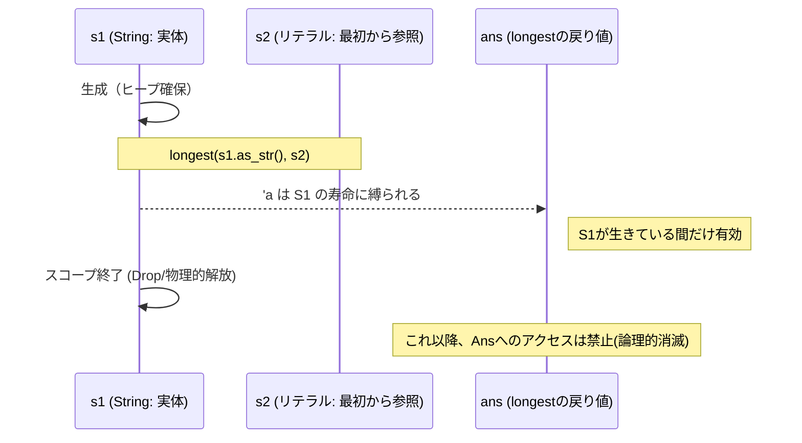

# Rust 05: Borrowing and Lifetimes

- [Rust 05: Borrowing and Lifetimes](#rust-05-borrowing-and-lifetimes)
  - [Overview](#overview)
  - [Borrowing Rules](#borrowing-rules)
  - [Understanding Lifetimes: The 'a Contract](#understanding-lifetimes-the-a-contract)
  - [String vs String Literals](#string-vs-string-literals)
  - [Lifetime Elision Rules](#lifetime-elision-rules)
  - [The Static Lifetime](#the-static-lifetime)
  - [Visualization: Lifetime Overlap and Safety](#visualization-lifetime-overlap-and-safety)

## Overview

借用（Borrowing）は、所有権を移動させずにデータにアクセスする仕組みです。Rustは「参照」が常に有効であることを保証するために**ライフタイム**という概念を使用します。これにより、データが消えた（スタックが戻った、またはヒープが解放された）後にその場所を指し続ける事故をコンパイル時に完全に防ぎます。

## Borrowing Rules

データ競合を防ぐため、借用チェッカーは以下の **"Aliasing XOR Mutability"** ルールを強制します。

1. **不変参照 (`&T`)**: 同時に何人でも貸し出せる（読み取り専用）。
2. **可変参照 (`&mut T`)**: 同時にたった一人しか貸し出せない。
   - **重要**: 可変参照がある間は、不変参照も存在できません。「誰かが書き換える可能性があるなら、他の人は読んでもいけない」というルールです。

## Understanding Lifetimes: The 'a Contract

ライフタイム注釈（`'a`）は、寿命を延ばす魔法ではありません。**「複数の参照の有効期限を、共通のグループとして束ねる契約書」**です。

- **役割**: 関数が参照を返す際、その参照の「賞味期限」がどの引数に依存しているかをコンパイラに明示します。
- **実態**: コンパイラは `'a` をもとに、「短い方の寿命」に合わせて戻り値の有効期限を設定します。

```rust
// 「戻り値の寿命は、xとyの両方が生きている期間（共通期間）に限定される」という契約
fn longest<'a>(x: &'a str, y: &'a str) -> &'a str {
    if x.len() > y.len() { x } else { y }
}

```

## String vs String Literals

借用を理解する上で、文字列の出自の違いを知ることは不可欠です。

|     種類     |         例          |       型       | メモリ位置 |                           特徴                            |
| :----------: | :-----------------: | :------------: | :--------: | :-------------------------------------------------------: |
|  **String**  | `String::from("a")` |    `String`    |   ヒープ   |     所有者あり。`as_str()` 等で参照を作る必要がある。     |
| **リテラル** |       `"abc"`       | `&'static str` |  バイナリ  | **最初から参照。** プログラム終了まで死なない最強の寿命。 |

## Lifetime Elision Rules

よくあるパターンは、コンパイラが自動で `'a` を補完（省略）します。

1. 引数が1つの参照なら、戻り値もその寿命になる。
2. `&self` があれば、戻り値は `self` の寿命になる。
3. **それ以外（引数が複数あり、どれを返すか不明な場合など）は明示的な `'a` が必要。**

## The Static Lifetime

`'static` はプログラムの開始から終了まで有効な特殊なライフタイムです。ダブルクォーテーションで囲まれた文字列リテラル(`"Hello"`)は、メモリリークの心配がない「静的データ」としてこの寿命を持ちます。

## Visualization: Lifetime Overlap and Safety

借用チェッカーは、物理的な解放（drop）のタイミングと、参照の利用タイミングを比較します。


