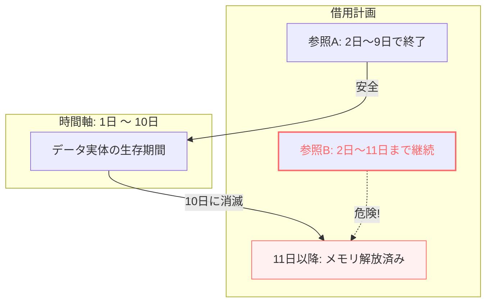

# Rust 05: Borrowing and Lifetimes

- [Rust 05: Borrowing and Lifetimes](#rust-05-borrowing-and-lifetimes)
  - [Overview](#overview)
  - [Borrowing Rules](#borrowing-rules)
  - [Understanding Lifetimes](#understanding-lifetimes)
  - [Lifetime Elision Rules](#lifetime-elision-rules)
  - [Lifetime Annotations in Structs](#lifetime-annotations-in-structs)
  - [The Static Lifetime](#the-static-lifetime)
  - [Visualization: Dangling Reference Prevention](#visualization-dangling-reference-prevention)

## Overview

借用（Borrowing）は、所有権を移動させずにデータにアクセスする仕組みです。Rustは「参照」が常に有効であることを保証するために**ライフタイム**という概念を使用します。これにより、データが消えた後にその場所を指し続ける「ダングリングポインタ」をコンパイル時に完全に防ぎます。

## Borrowing Rules

データ競合を防ぐため、借用チェッカーは以下の **"Aliasing XOR Mutability"** ルールを強制します。

1. **不変参照 (`&T`)**: 同時に何人でも貸し出せる（読み取り専用）。
2. **可変参照 (`&mut T`)**: 同時にたった一人しか貸し出せない。
   - **重要**: 可変参照がある間は、不変参照も存在できません。「誰かが書き換える可能性があるなら、他の人は読んでもいけない」というルールです。

## Understanding Lifetimes

ライフタイムは、参照が「有効である期間」を指します。

- **目的**: 貸主（所有者）が死んだ後も、借主（参照）が生き残るという事故を防ぐこと。
- **ライフタイム注釈 (`'a`)**: 関数が複数の参照を受け取り、参照を返す際、どの引数と戻り値の寿命が紐付いているかをコンパイラに伝えます。

```rust
// 「戻り値の寿命は、xとyのうち短い方の寿命と同じになる」という宣言
fn longest<'a>(x: &'a str, y: &'a str) -> &'a str {
    if x.len() > y.len() { x } else { y }
}

```

## Lifetime Elision Rules

コンパイラは、よくあるパターンについては注釈を自動で推論します（省略規則）。

1. 各引数の参照には、それぞれ独自のライフタイムが割り当てられる。
2. 入力参照が1つだけなら、その寿命がすべての出力参照に割り当てられる。
3. メソッド（`&self` を持つ場合）は、`self` の寿命が出力参照すべてに割り当てられる。

## Lifetime Annotations in Structs

構造体が「参照」をフィールドとして持つ場合、その構造体は参照先より長く生きることはできません。そのため、構造体定義にもライフタイム注釈が必要です。

```rust
struct Excerpt<'a> {
    part: &'a str, // 構造体は part が指すデータより長く生きられない
}

```

## The Static Lifetime

`'static` は特別なライフタイムで、プログラムの開始から終了までずっと有効であることを示します。

- 文字列リテラル (`"Hello"`) はバイナリに直接書き込まれているため、常に `'static` です。

## Visualization: Dangling Reference Prevention

借用チェッカーは、**「データの寿命」** と **「参照の寿命」** を比較し、参照の方が長く生きようとした場合にコンパイルエラーを出します。


