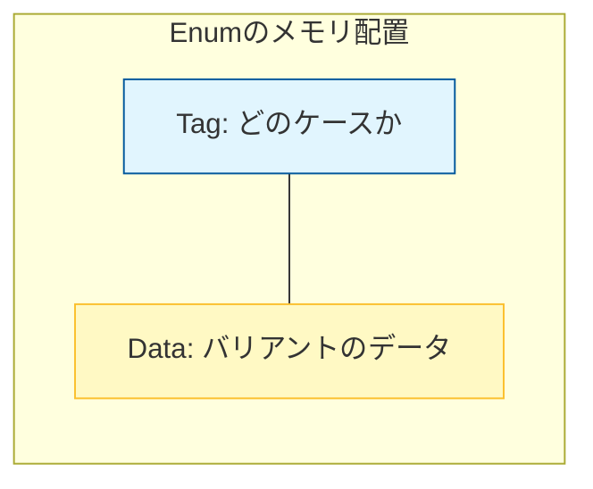

# Rust 06: Structs and Enums

- [Rust 06: Structs and Enums](#rust-06-structs-and-enums)
  - [Overview](#overview)
  - [Key Terms](#key-terms)
  - [Concise Explanation of Terms](#concise-explanation-of-terms)
  - [Memory Representation and Safety](#memory-representation-and-safety)
  - [Code Example: Structs and Enums in Action](#code-example-structs-and-enums-in-action)
  - [Technical Points: Pattern Matching and Beyond](#technical-points-pattern-matching-and-beyond)

## Overview

構造体（Structs）は関連する複数の値を一つの塊にまとめる方法であり、列挙型（Enums）は「ある値がいずれかのバリアント（候補）である」ことを表現する方法です。特にRustのEnumは、代数的データ型（Algebraic Data Types）に近く、強力なパターンマッチングと組み合わせてプログラムのロジックを安全に記述できます。

## Key Terms

- **Struct variants**: 構造体（名前付きフィールド、タプル構造体、ユニット構造体）。
- **Enum variants**: 列挙型の各選択肢。それぞれが異なる型や量のデータを持つことができる。
- **Pattern matching (`match`)**: 値を構造分解し、条件に応じた処理を行う。コンパイラによる「網羅性チェック」が伴う。

## Concise Explanation of Terms

- **Struct Types**:
- **Classic Struct**: `struct User { id: u32 }` （名前付きフィールド）。
- **Tuple Struct**: `struct Color(i32, i32, i32)` （フィールド名がなく、位置で区別）。
- **Unit-like Struct**: `struct AlwaysEqual;` （フィールドなし。トレイトの実装などに利用）。
- **Enum variants**: ただの数値の列挙ではなく、`Message::Write(String)` のようにバリアントごとに異なるデータ構造を内包できる。
- **Exhaustiveness (網羅性)**: `match`文はすべての可能性をカバーしなければならない。これにより「処理の漏れ」がコンパイル時に防がれる。

## Memory Representation and Safety

RustのEnumは「タグ付き共用体（Tagged Union）」としてメモリ上に配置されます。



* **Tag**: 現在どのバリアントであるかを識別する小さな整数。
* **Data**: 最も大きなデータを持つバリアントに合わせてメモリが確保される。

## Code Example: Structs and Enums in Action

```rust
struct Point { x: f64, y: f64 }

enum Message {
    Quit,                       // データなし
    Move { x: i32, y: i32 },    // 名前付きフィールド
    Write(String),              // タプル形式のデータ
    ChangeColor(i32, i32, i32), // 複数の値
}

fn process(msg: Message) {
    match msg {
        Message::Quit => println!("Quit"),
        // 構造分解して内部の値を取り出す
        Message::Move { x, y } => println!("Move to x:{}, y:{}", x, y),
        Message::Write(s) => println!("Message: {}", s),
        // 不要な値は _ で無視できる
        Message::ChangeColor(r, g, _) => println!("Color: r:{}, g:{}", r, g),
    }
}

```

## Technical Points: Pattern Matching and Beyond

- `Option<T>` と `Result<T, E>`: これらはRust標準ライブラリで最も重要な `enum`。Null（空の値）や例外をこれらのEnumで表現することで、安全なエラー処理を実現する。
- **Syntactic Sugar**:
- **`if let`**: 特定の1つのバリアントだけに興味がある場合、`match`より簡潔に書ける。


```rust
if let Message::Write(text) = msg {
    println!("Writing: {}", text);
}

```

- **Methods (`impl`)**: 構造体だけでなく、列挙型にもメソッドを定義できる。
