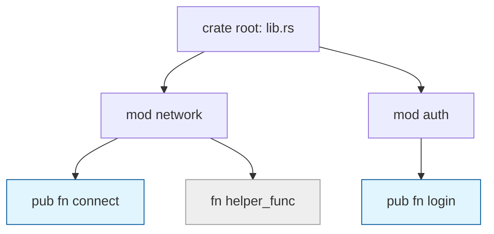

# Rust 07: Module, Crate, and Visibility

- [Rust 07: Module, Crate, and Visibility](#rust-07-module-crate-and-visibility)
  - [Overview](#overview)
  - [Key Terms](#key-terms)
  - [Concise Explanation of Terms](#concise-explanation-of-terms)
  - [Module Hierarchy and Paths](#module-hierarchy-and-paths)
  - [Visibility Rules (The Privacy Boundary)](#visibility-rules-the-privacy-boundary)
  - [Points to Note: File System Integration](#points-to-note-file-system-integration)

## Overview

Rustのモジュールシステムは、コードを論理的に分割し、名前空間（Namespace）を管理するための仕組みです。情報の隠蔽（カプセル化）を重視しており、明示的に `pub` と指定しない限り、外部から中身を見ることはできません。

## Key Terms

- **Module (`mod`)**: コードをグループ化する単位。ファイルやディレクトリと対応する。
- **Crate**: Rustにおけるコンパイルの最小単位。バイナリ（実行ファイル）またはライブラリ。
- **Package**: `Cargo.toml` で管理される1つ以上のクレートの集合。
- **Path**: `std::collections::HashMap` のように、要素を指し示す住所。

## Concise Explanation of Terms

- **Crate Root**: コンパイラがビルドを開始するファイル（`src/main.rs` や `src/lib.rs`）。
- **pub / private**: デフォルトは **private**（自分と子モジュールからのみ見える）。`pub` をつけることで親モジュール以上に公開される。
- **`use` キーワード**: 長いパスを現在のスコープに持ち込み、短縮名で使えるようにする（シンボリックリンクのようなもの）。

## Module Hierarchy and Paths

モジュールは木構造（Tree）を形成します。アクセス方法は2種類あります。

1. **Absolute Path (絶対パス)**: `crate`（現在のクレートのルート）から始まる。
2. **Relative Path (相対パス)**: `self`（自分）、`super`（親）などから始まる。

## Visibility Rules (The Privacy Boundary)

公開範囲をより細かく制御するための修飾子があります。

- **`pub`**: 制限なし。どこからでも見える。
- **`pub(crate)`**: 現在のクレート内ならどこでも見える。
- **`pub(super)`**: 親モジュールの中でのみ見える。
- **`pub(in path)`**: 指定したパス内でのみ見える。

## Points to Note: File System Integration

Rust 2018 エディション以降、ファイル分割は以下のルールで行うのが一般的です。

1. **宣言**: `src/lib.rs` で `mod network;` と宣言する。
2. **実体**: `src/network.rs` または `src/network/mod.rs` というファイルに中身を書く。

> **注意**: フォルダを作っただけではモジュールになりません。必ず親モジュールで `mod` 宣言を行う必要があります。
