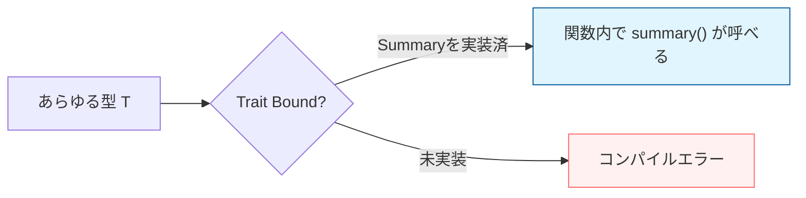

# Rust 09: Generics, Traits, and Lifetimes

- [Rust 09: Generics, Traits, and Lifetimes](#rust-09-generics-traits-and-lifetimes)
  - [Overview](#overview)
  - [Key Terms](#key-terms)
  - [Concise Explanation: The Pillars of Abstraction](#concise-explanation-the-pillars-of-abstraction)
  - [Conceptual Diagram: Trait Bounds and Generics](#conceptual-diagram-trait-bounds-and-generics)
  - [Code Example: Integrating Generics and Traits](#code-example-integrating-generics-and-traits)
  - [Technical Notes: Dispatch and Performance](#technical-notes-dispatch-and-performance)

## Overview

ジェネリクスは具体的な型を抽象化してコードの重複を避け、トレイトは型が「何ができるか（振る舞い）」を定義します。これらにライフタイムを組み合わせることで、**「どんな型でも、どんな期間でも、安全に」** 扱える堅牢な抽象化が可能になります。

## Key Terms

- **Generics (`<T>`)**: 複数の型で動作する関数や構造体を定義するための「型の変数」。
- **Trait Bounds (`T: Trait`)**: ジェネリクスに対して「このメソッドを持っている型しか受け付けない」という制約。
- **Trait Object (`&dyn Trait`)**: 実行時に具体的な型を決定する動的ディスパッチ（柔軟性重視）。
- **Associated Types**: トレイト内で定義される「出力型」。イテレータなどで多用される。

## Concise Explanation: The Pillars of Abstraction

1. **Generics**: 「数値なら何でもOK」のように、型をパラメータ化します。コンパイル時に具体的な型ごとにコードが生成される（単態化）ため、実行速度は具体的な型を書いた時と変わりません。
2. **Trait**: 他言語の「インターフェース」に近いですが、既存の型（`i32` など）に対しても後付けで実装できる点が強力です。
3. **Lifetimes**: ジェネリクスと併用する際、参照が含まれる場合は「その参照がいつまで有効か」を型パラメータと同様に扱う必要があります。

## Conceptual Diagram: Trait Bounds and Generics

トレイト境界は、ジェネリクスという「広すぎる門」に「フィルター」をかける役割を果たします。



## Code Example: Integrating Generics and Traits

```rust
trait Summary {
    fn summarize(&self) -> String;
}

struct Article { title: String, content: String }

impl Summary for Article {
    fn summarize(&self) -> String { format!("{}: ...", self.title) }
}

// ジェネリクスとトレイト境界: 「Summaryを実装した型なら何でも」
fn notify<T: Summary>(item: &T) {
    println!("Breaking news! {}", item.summarize());
}

// ライフタイムを含む複雑な例
fn longest_with_announcement<'a, T>(x: &'a str, y: &'a str, ann: T) -> &'a str
where T: std::fmt::Display, 
{
    println!("Announcement: {}", ann);
    if x.len() > y.len() { x } else { y }
}

```

## Technical Notes: Dispatch and Performance

Rustは抽象化のコストを開発者がコントロールできます。

- **静的ディスパッチ (Static Dispatch)**:
  - `<T: Trait>` を使用。
  - コンパイル時に型ごとに専用のコードを作る。
  - **メリット**: 実行時にコストゼロ。インライン化が可能。
- **動的ディスパッチ (Dynamic Dispatch)**:
  - `&dyn Trait` や `Box<dyn Trait>` を使用。
  - 実行時に「vtable」を参照してメソッドを呼ぶ。
  - **メリット**: 異なる型を一つの配列（`Vec<Box<dyn Trait>>`）に入れることができる。
