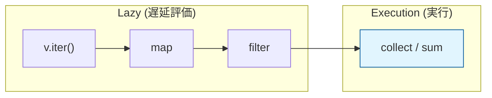

# Rust 10: Closures and Iterators

- [Rust 10: Closures and Iterators](#rust-10-closures-and-iterators)
  - [Overview](#overview)
  - [Key Terms](#key-terms)
  - [Concise Explanation: Functional Features](#concise-explanation-functional-features)
  - [Deep Dive: Closure Traits (Fn, FnMut, FnOnce)](#deep-dive-closure-traits-fn-fnmut-fnonce)
  - [The Power of Iterators: Lazy Evaluation](#the-power-of-iterators-lazy-evaluation)
  - [Code Example: Functional Composition](#code-example-functional-composition)
  - [Technical Note: Zero-Cost Abstraction](#technical-note-zero-cost-abstraction)

## Overview

クロージャ（Closures）は変数に保存したり引数として渡せる「匿名関数」であり、定義されたスコープ内の値をキャプチャ（捕獲）できるのが特徴です。イテレータ（Iterators）は一連の要素に対する処理の抽象化であり、関数型プログラミングのような記述を、ネイティブコード並みの実行速度で実現します。

## Key Terms

- **Closure (`|| { ... }`)**: 周囲の環境（変数）を閉じ込める関数。
- **Iterator Trait**: `next` メソッドを持つ、要素を一つずつ生成する仕組み。
- **Adaptors (`map`, `filter`)**: イテレータを別のイテレータに変換する（中間操作）。
- **Consumers (`collect`, `sum`)**: イテレータを消費して最終的な結果を得る（終端操作）。

## Concise Explanation: Functional Features

- **環境のキャプチャ**: クロージャは、定義場所にある変数を「借用」または「所有」できます。`move` キーワードを使うと、所有権を強制的にクロージャ内に移せます。
- **遅延評価 (Lazy Evaluation)**: イテレータのアダプタを呼んだだけでは何も実行されません。「消費者」が呼ばれた瞬間に初めて計算が始まります。これにより、無駄な中間配列の生成を避けられます。

## Deep Dive: Closure Traits (Fn, FnMut, FnOnce)

クロージャが環境をどう扱うかによって、自動的に3つのトレイトのいずれかを実装します。

| トレイト | 特徴 | キャプチャの仕組み |
| --- | --- | --- |
| **`Fn`** | 何度でも呼べる | 不変借用 (`&T`)。値を読み取るだけ。 |
| **`FnMut`** | 何度でも呼べる | 可変借用 (`&mut T`)。値を書き換える。 |
| **`FnOnce`** | **1回しか呼べない** | 所有権の移動 (`T`)。値を消費（ドロップ）する。 |

## The Power of Iterators: Lazy Evaluation

イテレータの連鎖は、コンパイル時に一つの最適化されたループに変換されます。



## Code Example: Functional Composition

```rust
fn main() {
    let v = vec![1, 2, 3, 4, 5];

    // イテレータの連鎖（アダプタ）
    let sum: i32 = v.iter()
        .map(|x| x * 2)      // 各要素を2倍
        .filter(|x| x > 5)   // 5より大きいものだけ抽出
        .sum();              // 消費者：ここで初めて計算が実行される

    println!("Sum: {}", sum); // 6 + 8 + 10 = 24

    // moveクロージャの例
    let data = vec![1, 2, 3];
    let closure = move || println!("Owned: {:?}", data);
    closure();
    // println!("{:?}", data); // ❌ 所有権が移動しているためエラー
}

```

## Technical Note: Zero-Cost Abstraction

- Rustのイテレータは、手書きの `for` ループと全く同じか、場合によってはそれよりも高速なアセンブリにコンパイルされます（境界線チェックの最適化など）。
- クロージャも、コンパイル時に「そのクロージャ専用の型」が作られるため、関数ポインタを介した呼び出しのオーバーヘッドがありません。
