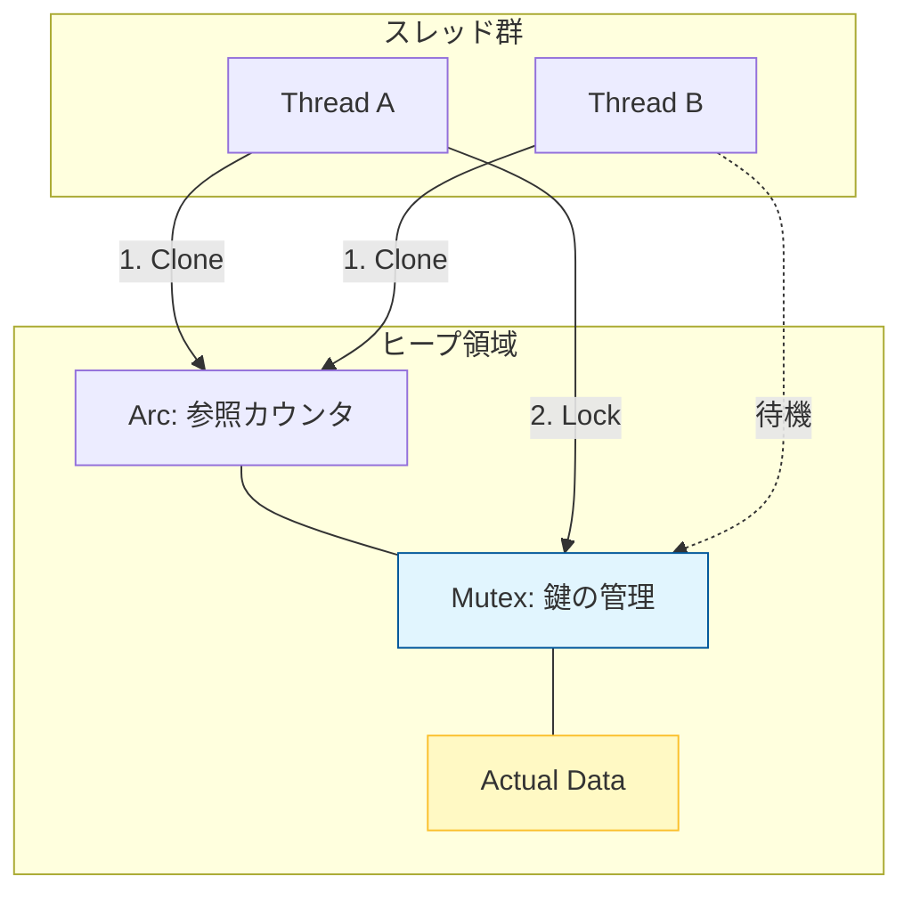

# Rust 12: Concurrency & Async

- [Rust 12: Concurrency \& Async](#rust-12-concurrency--async)
  - [Overview](#overview)
  - [Key Terms](#key-terms)
  - [The Pillars of Fearless Concurrency](#the-pillars-of-fearless-concurrency)
  - [Thread-Wide Sharing Architecture](#thread-wide-sharing-architecture)
  - [Asynchronous Programming (async/await)](#asynchronous-programming-asyncawait)
  - [Technical Notes: Send and Sync](#technical-notes-send-and-sync)

## Overview

Rustは「データ競合（Data Race）」をコンパイル時に完全に排除します。これは、スレッド間でデータを渡す際に**所有権**が移動するか、**スレッド安全な型**で包まれているかをコンパイラがチェックするためです。非同期処理（async）は、OSスレッドを節約しながら大量のI/O待ちを効率よく処理する仕組みを提供します。

## Key Terms

- **`std::thread`**: OSレベルのスレッドを生成。計算資源を並列に使う際に使用。
- **`Arc<Mutex<T>>`**: スレッド間で安全にデータを「共有」し、「変更」するための定番セット。
- **`Send`**: スレッドをまたいで「移動」できる型であることを示すトレイト。
- **`Sync`**: 複数のスレッドから同時に「参照」しても安全な型であることを示すトレイト。
- **`Future`**: 「いつか完了する計算」を表現する値。非同期処理の本体。
- **Executor (Runtime)**: `Future` をスケジュールし、実際に実行するエンジン（Tokioなど）。

## The Pillars of Fearless Concurrency

Rustが並行処理を安全にできるのは、以下のルールがあるからです。

1. **所有権の移動**: スレッドを `spawn` する際、値を `move` すれば、元のスレッドからは触れなくなるため競合が起きません。
2. **共有の制限**: `Rc` のようなスレッド安全でない型をスレッド間で渡そうとすると、`Send` が実装されていないためコンパイルエラーになります。

## Thread-Wide Sharing Architecture

複数のスレッドから同じデータにアクセスしたい場合、`Arc`（共有）と `Mutex`（ロック）を組み合わせて使います。



## Asynchronous Programming (async/await)

非同期処理は、スレッドを止めずに「待ち時間」を有効活用します。

- **`async`**: 関数を「呼び出すと `Future` を返す関数」に変える。
- **`.await`**: `Future` の計算が終わるまで待機する（その間、実行エンジンは他の作業ができる）。

```rust
use tokio; // ランタイムが必要

async fn fetch_data() -> String {
    // ネットワーク通信などの待機が発生する処理
    "Data received".to_string()
}

#[tokio::main]
async fn main() {
    // 非同期関数を呼び出し、結果を待つ
    let result = fetch_data().await;
    println!("{}", result);
}

```

## Technical Notes: Send and Sync

これらは手動で実装するものではなく、コンパイラが自動で判断する「マーカートレイト」です。

- **ほぼ全ての型は `Send` かつ `Sync**` です。
- **例外**:
  - `Rc<T>` はスレッド間でカウンタを更新すると壊れるため、`Send` でも `Sync` でもありません。
  - `RefCell<T>` はスレッド安全な借用チェックを行わないため、`Sync` ではありません。

> **結論**: スレッド間で渡せないものを渡そうとすると、コンパイラが「それは安全じゃない！」と教えてくれる。これが Rust の並行処理の強みです。
