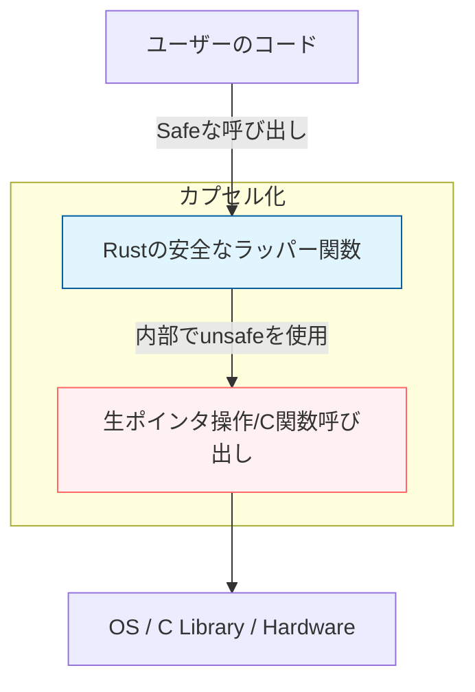

# Rust 13: unsafe & FFI

- [Rust 13: unsafe \& FFI](#rust-13-unsafe--ffi)
  - [Overview](#overview)
  - [Key Terms](#key-terms)
  - [The Five Superpowers of Unsafe](#the-five-superpowers-of-unsafe)
  - [Concise Explanation: Why Unsafe?](#concise-explanation-why-unsafe)
  - [Code Example: Calling C Functions (FFI)](#code-example-calling-c-functions-ffi)
  - [Notes: Safety Abstraction](#notes-safety-abstraction)

## Overview

Rustのコンパイラは非常に保守的です。しかし、デバイスドライバの作成や他言語との連携など、コンパイラが「安全である」と確信を持てない操作が必要な場合があります。`unsafe`ブロックは、Rustの「借用チェッカー」の一部を無効化し、低レベルなメモリ操作を可能にします。

## Key Terms

- **Raw Pointer (`*const T`, `*mut T`)**: 生ポインタ。Nullになる可能性があり、有効期間もチェックされません。
- **FFI (Foreign Function Interface)**: 他のプログラミング言語（主にC）で書かれた関数を呼び出すための仕組み。
- **ABI (Application Binary Interface)**: 関数を呼び出す際の下位レベルの規約（データの並び順など）。通常 `extern "C"` を使用。
- **Undefined Behavior (UB)**: 未定義動作。メモリ破壊やクラッシュの原因となり、絶対に避けるべき領域。

## The Five Superpowers of Unsafe

`unsafe` ブロック内でのみ、以下の5つの「超能力」が解禁されます。

1. 生ポインタをデリファレンス（参照先にアクセス）すること
2. `unsafe` な関数やメソッドを呼び出すこと
3. 可変な静的変数（`static mut`）にアクセス、または修正すること
4. `union`（共用体）のフィールドにアクセスすること
5. `unsafe` なトレイトを実装すること

## Concise Explanation: Why Unsafe?

Rustの「安全な世界」と「ハードウェア/他言語の未開の地」を繋ぐブリッジとして機能します。

- **Raw Pointers**: `&T`（参照）とは違い、借用規則に従いません。C言語のポインタと直接互換性がありますが、中身が正しいかはプログラマが保証しなければなりません。
- **FFI**: C言語のライブラリ（OpenSSL, SQLiteなど）をRustから叩くために使われます。外部関数の呼び出しは、Rust側からは安全性が検証できないため、常に `unsafe` です。

## Code Example: Calling C Functions (FFI)

```rust
// 標準Cライブラリの関数を宣言
extern "C" {
    // 呼び出し規約(ABI)を"C"に指定
    fn abs(input: i32) -> i32;
}

fn main() {
    let input = -3;

    // 外部関数の呼び出しは安全性が保証されないため、unsafeが必要
    unsafe {
        println!("Absolute value of {} is {} according to C.", input, abs(input));
    }
}

```

## Notes: Safety Abstraction

Rustの設計哲学として、**「unsafeを安全なAPIで包む」** という非常に重要な原則があります。



- **カプセル化**: 内部でどれだけ危険なことをしていても、公開するAPIが安全（型安全、借用安全）であれば、利用者は `unsafe` を意識せずに済みます。
- **最小化**: `unsafe` ブロックは、バグの調査対象を絞り込むために、可能な限り小さく書くべきです。
