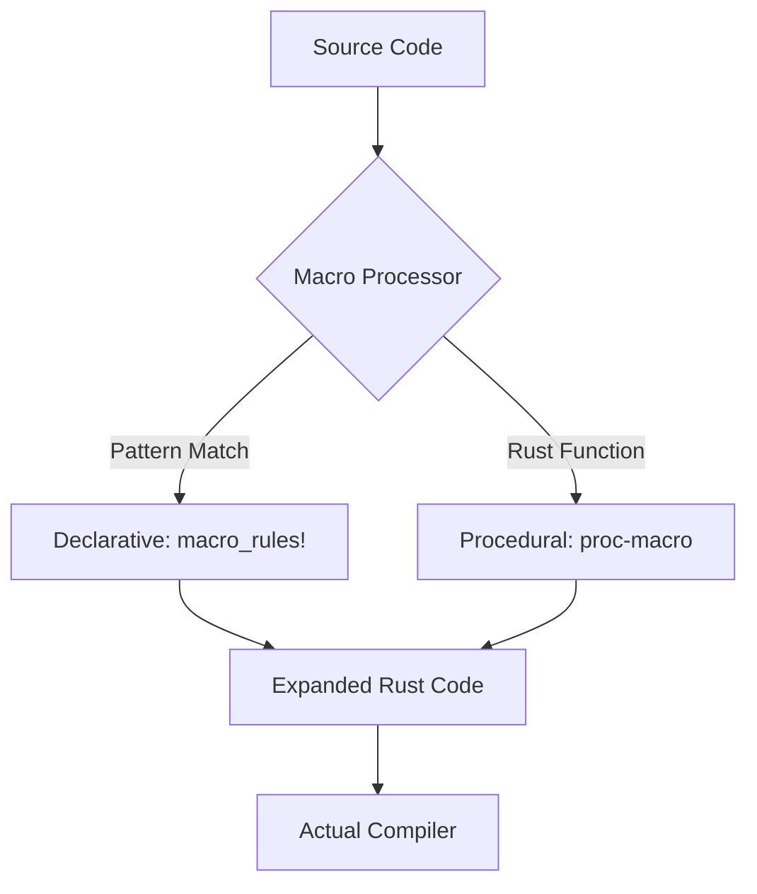

# Rust 14: Macros (Declarative & Procedural)

- [Rust 14: Macros (Declarative \& Procedural)](#rust-14-macros-declarative--procedural)
  - [Overview](#overview)
  - [Key Terms](#key-terms)
  - [Concise Explanation: Meta-Programming](#concise-explanation-meta-programming)
  - [The Two Types of Macros](#the-two-types-of-macros)
  - [Example: Simple macro\_rules!](#example-simple-macro_rules)
  - [Technical Notes: Hygiene and Expansion](#technical-notes-hygiene-and-expansion)

## Overview

マクロは、コンパイル中に他のコードを生成する仕組みです。関数とは異なり、可変長の引数を受け取ったり、構造体に自動でメソッドを生やしたり（`derive`）するなど、Rustの標準的な構文の枠を超えたコードの自動生成を可能にします。

## Key Terms

- **Declarative Macros (`macro_rules!`)**: パターンマッチングを利用したマクロ。「この構文が来たら、こう展開する」というルールを書く。
- **Procedural Macros (`proc-macro`)**: Rust関数として定義するマクロ。コンパイラから渡される「トークンの流れ」を計算して加工する。
- **TokenStream**: プログラミング言語の構文要素（キーワード、変数名、記号など）の集まり。
- **Hygiene (健全性)**: マクロ内で定義された変数が、マクロ呼び出し側の変数と衝突しないように保護する仕組み。

## Concise Explanation: Meta-Programming

関数は「値」を操作しますが、マクロは「コードそのもの」を操作します。

1. **メタプログラミング**: 手書きすると面倒な定型コード（ボイラープレート）を自動化します。
2. **展開 (Expansion)**: コンパイルの初期段階でマクロが実行され、コードが「書き換え」られます。コンパイラの本番処理（型チェックなど）はその「展開後」のコードに対して行われます。

## The Two Types of Macros

| 種類 | 記述方法 | 特徴 | 主な用途 |
| --- | --- | --- | --- |
| **宣言的 (`macro_rules!`)** | `match` のような構文 | 比較的シンプル、同じクレート内で定義可能 | `vec!`, `println!` |
| **プロシージャル (`proc-macro`)** | Rustの関数 (Rustコード) | 非常に強力、別クレートが必要 | `#[derive(Serialize)]`, `#[get("/")]` |



## Example: Simple macro_rules!

```rust
// 宣言的マクロの定義
macro_rules! create_function {
    // $func_name という識別子(ident)を受け取って関数を作る
    ($func_name:ident) => {
        fn $func_name() {
            println!("You called {:?}()", stringify!($func_name));
        }
    };
}

create_function!(foo);
create_function!(bar);

fn main() {
    foo(); // "You called foo()"
    bar(); // "You called bar()"
}

```

## Technical Notes: Hygiene and Expansion

- **マクロのデバッグ**: `cargo expand` というコマンド（サードパーティ製）を使うと、マクロが実際にどんなコードに展開されたかを確認できます。
- **コンパイル速度**: プロシージャルマクロ（特に `serde` や `syn` など）を多用すると、コンパイル時に実行される処理が増えるため、ビルド時間が長くなる傾向があります。
- **proc-macro の制約**: プロシージャルマクロを定義する場合、専用のライブラリクレート（`proc-macro = true` を指定したもの）を用意する必要があります。
