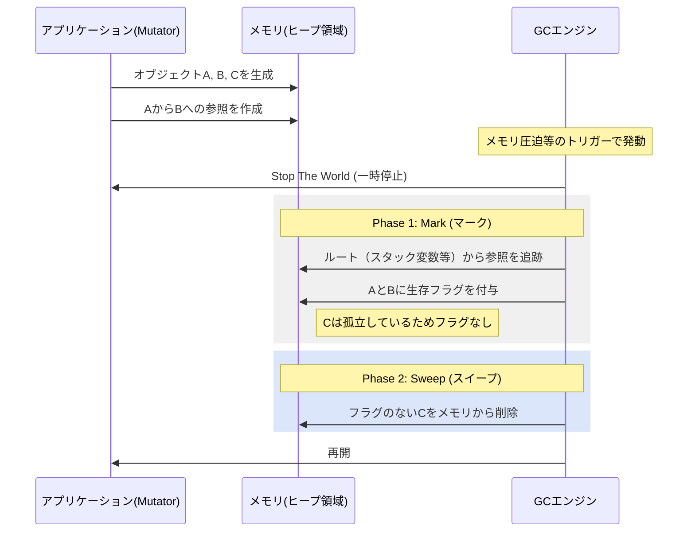
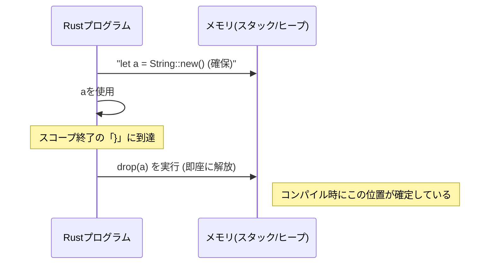

# Additional Notes

- [Additional Notes](#additional-notes)
  - [GC (Garbage Collection): Non-Deterministic Release](#gc-garbage-collection-non-deterministic-release)
    - [1. Definition and Mechanism of GC](#1-definition-and-mechanism-of-gc)
    - [2. How GC Works: Mark \& Sweep](#2-how-gc-works-mark--sweep)
  - [Memory Management Strategy: GC vs Rust](#memory-management-strategy-gc-vs-rust)
    - [1. GC Languages (Java/Go, etc.): “Clean up later in bulk”](#1-gc-languages-javago-etc-clean-up-later-in-bulk)
    - [2. Rust: “Put it away the moment you're done using it.”](#2-rust-put-it-away-the-moment-youre-done-using-it)
  - [Key Concept: Deterministic vs Non-deterministic](#key-concept-deterministic-vs-non-deterministic)
    - [Supplementary Notes: Ownership and Lifespan](#supplementary-notes-ownership-and-lifespan)

## GC (Garbage Collection): Non-Deterministic Release

### 1. Definition and Mechanism of GC

GCは、実行時（Runtime）にメモリの動的な使用状況を監視し、不要になった領域を自動的に回収するソフトウェア層です。

**GCに課せられる技術的トレードオフ：**

- **スループット:** 単位時間あたりの処理量。
- **ポーズ時間 (Latency):** 掃除のためにアプリを止める「Stop The World (STW)」の長さ。
- **メモリオーバーヘッド:** GCアルゴリズム自体が消費するメモリ量。

### 2. How GC Works: Mark & Sweep

多くの言語で採用されている、オブジェクトの到達可能性（Reachability）を判定するアルゴリズムです。

## Memory Management Strategy: GC vs Rust

「いつ、誰が、どうやって」メモリを解放するか。この決定プロセスに決定的な違いがあります。

### 1. GC Languages (Java/Go, etc.): “Clean up later in bulk”

プログラマの手を離れた後、ランタイムが都合の良いタイミングで解放します。これを**非決定論的（Non-deterministic）**な解放と呼びます。

- **メリット:** 参照の複雑な循環があっても、誰からも辿れなくなれば確実に回収できる。
- **デメリット:** メモリがいつ解放されるか予測できないため、リアルタイム性が求められるシステム（ゲーム、組み込み等）ではSTWがボトルネックになる。

### 2. Rust: “Put it away the moment you're done using it.”

コンパイル時に変数の「スコープ（生存範囲）」を確定し、その末尾に解放命令（`drop`）を自動挿入します。これを**決定論的（Deterministic）**な解放と呼びます。

- **メリット:** 関数を抜ける瞬間にメモリが確実に解放される。GCのような実行時の監視コストがゼロ。
- **デメリット:** 所有権ルールにより、複雑なグラフ構造（循環参照など）を構築する際に設計の工夫が必要。

## Key Concept: Deterministic vs Non-deterministic

理系的な視点で最も重要なのは、**「予測可能性（Predictability）」** です。

| 項目 | GC言語 (非決定論的) | Rust (決定論的) |
| --- | --- | --- |
| **解放タイミング** | ランタイムの計算資源に依存 | ソースコードの構造に依存 |
| **ランタイム負荷** | CPU/メモリの一部を常時消費 | 消費なし（ゼロコスト抽象化） |
| **リソース管理** | メモリ以外（ファイル、ソケット）の解放が遅れる可能性あり | `Drop`トレイトによりあらゆるリソースを即座に閉じられる |

### Supplementary Notes: Ownership and Lifespan

Rustで「使い終わった」とみなされるのは、**所有権を持っている変数が有効範囲を抜けた時**です。もし関数内で `println!` した後にその変数を別の関数に **ムーブ（Move）** した場合、解放の責任もその新しい関数へと引き継がれます。これにより、ポインタの「宙ぶらりん（Dangling）」状態がコンパイル段階で完全に排除されます。
