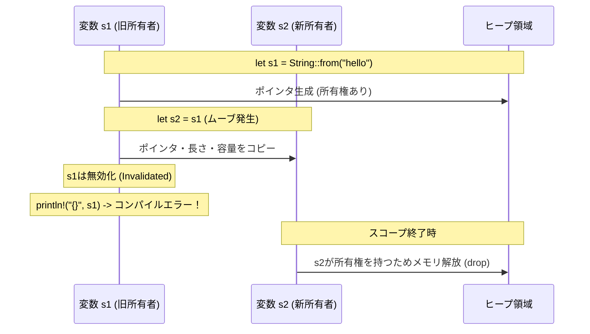
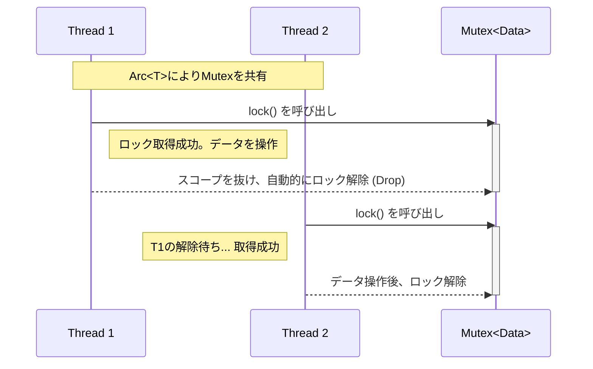

# Rust: Basic

- [Rust: Basic](#rust-basic)
  - [1. 導入：Rustの設計思想とシステムプログラミング](#1-導入rustの設計思想とシステムプログラミング)
  - [2. プロジェクト管理とビルドシステム (Cargo)](#2-プロジェクト管理とビルドシステム-cargo)
  - [3. 基礎概念：変数、型、関数](#3-基礎概念変数型関数)
    - [変数と可変性 (Mutability)](#変数と可変性-mutability)
    - [データ型 (Data Types)](#データ型-data-types)
  - [4. 所有権システムとメモリ管理](#4-所有権システムとメモリ管理)
    - [4.1. 所有権の規則 (Ownership Rules)](#41-所有権の規則-ownership-rules)
    - [4.2. メモリレイアウト：スタック vs ヒープ](#42-メモリレイアウトスタック-vs-ヒープ)
    - [4.3. ムーブ (Move) と コピー (Copy)](#43-ムーブ-move-と-コピー-copy)
    - [4.4. 参照と借用 (References and Borrowing)](#44-参照と借用-references-and-borrowing)
  - [5. 構造化プログラミング：構造体と列挙型](#5-構造化プログラミング構造体と列挙型)
    - [構造体 (Structs)](#構造体-structs)
    - [列挙型 (Enums) とパターンマッチング](#列挙型-enums-とパターンマッチング)
  - [6. モジュールシステムと可視性](#6-モジュールシステムと可視性)
  - [7. コレクションとエラーハンドリング](#7-コレクションとエラーハンドリング)
    - [コレクション (Collections)](#コレクション-collections)
    - [エラーハンドリング](#エラーハンドリング)
  - [8. 抽象化：ジェネリクス、トレイト、ライフタイム](#8-抽象化ジェネリクストレイトライフタイム)
    - [8.1. ジェネリクス (Generics)](#81-ジェネリクス-generics)
    - [8.2. トレイト (Traits)](#82-トレイト-traits)
    - [8.3. ライフタイム (Lifetimes)](#83-ライフタイム-lifetimes)
  - [9. 関数型プログラミングの機能](#9-関数型プログラミングの機能)
  - [10. スマートポインタと内部可変性](#10-スマートポインタと内部可変性)
  - [11. 並行処理 (Concurrency)](#11-並行処理-concurrency)
    - [11.1. スレッド (Threads)](#111-スレッド-threads)
    - [11.2. メッセージパッシング](#112-メッセージパッシング)
    - [11.3. 共有状態 (Shared State)](#113-共有状態-shared-state)

## 1. 導入：Rustの設計思想とシステムプログラミング

Rustは「安全性（Safety）」「速度（Speed）」「並行性（Concurrency）」の3つを同時に達成することを目指した言語です。

- **ゼロコスト抽象化**: 高水準な記述（イテレータやジェネリクス）をしても、コンパイル後の機械語は手書きのアセンブリと同等の効率になります。
- **ガベージコレクション（GC）なし**: ランタイムのオーバーヘッドを極小化し、予測可能な性能を提供します。これは組込みシステムやOS開発において重要です。
- **メモリ安全性**: コンパイル時にメモリ管理の正当性を検証し、セグメンテーション違反やデータ競合を未然に防ぎます。

## 2. プロジェクト管理とビルドシステム (Cargo)

Rustの開発は、コンパイラ(`rustc`)だけでなく、パッケージマネージャ兼ビルドシステムである**Cargo**を中心に行います。

- **依存関係の解決**: `Cargo.toml`（TOML形式）にライブラリ（クレート）を記述するだけで、ダウンロードとビルドを自動化します。
- **再現性**: `Cargo.lock`ファイルにより、依存ライブラリのバージョンを固定し、どの環境でも同じビルド結果を保証します。

**コマンド例:**

- `cargo new <project>`: 新規プロジェクト作成
- `cargo build`: コンパイル（デバッグ用）
- `cargo run`: コンパイルして実行
- `cargo check`: 実行ファイル生成をスキップして構文チェックのみ行う（高速）

## 3. 基礎概念：変数、型、関数

### 変数と可変性 (Mutability)

Rustの変数は**デフォルトで不変（Immutable）** です。これは、値が予期せず変更されることによるバグを防ぐためです。可変にするには `mut` キーワードが必要です。

```rust
let x = 5;       // 不変
let mut y = 5;   // 可変
y = 6;           // OK

```

### データ型 (Data Types)

Rustは静的型付け言語ですが、型推論（Type Inference）が強力です。

1. **スカラー型**:
   - 整数: `i8`, `u32`, `isize` (アーキテクチャ依存) など。
   - 浮動小数点: `f32`, `f64` (デフォルト)。
   - 論理値: `bool`
   - 文字: `char` (Unicodeスカラー値、4バイト)。
2. **複合型**:
   - **タプル**: 異なる型を固定長でまとめる。`(i32, f64, u8)`。
   - **配列**: 同じ型を固定長でまとめる。スタック上に確保される。`[i32; 5]`。

## 4. 所有権システムとメモリ管理

RustをRustたらしめる最重要概念です。GCなしでメモリ安全性を担保する仕組みを理解しましょう。

### 4.1. 所有権の規則 (Ownership Rules)

1. Rustの各値は、**所有者（Owner）** と呼ばれる変数を持つ。
2. いかなる時も、所有者は一つだけである。
3. 所有者がスコープを抜けたとき、値は破棄（Drop）される。

### 4.2. メモリレイアウト：スタック vs ヒープ

- **スタック**: 固定サイズの値（整数など）をLIFO（Last In, First Out）で高速に処理。
- **ヒープ**: コンパイル時にサイズが不定な値（`String`など）を格納。ポインタ経由でアクセスするためスタックより低速。

### 4.3. ムーブ (Move) と コピー (Copy)

ヒープデータを持つ変数（例: `String`）を別の変数に代入すると、ポインタ情報のみがコピーされ、**元の変数は無効化**されます。これを「ムーブ」と呼び、二重解放エラー（Double Free）を防ぎます。



一方、スタックのみのデータ（`i32`など）は「コピー」され、元の変数も有効なままです。

### 4.4. 参照と借用 (References and Borrowing)

所有権を渡さずに値を使用したい場合、「参照（Reference, `&`）」を使います。これを「借用」と呼びます。

**借用のルール:**

1. 任意のタイミングで、**一つの可変参照**（`&mut T`）か、**複数の不変参照**（`&T`）のどちらかを持てるが、両方は持てない。
   - これにより、コンパイル時に**データ競合（Data Race）** を完全に排除します。
2. 参照は常に有効でなければならない（ダングリングポインタの禁止）。

    ```mermaid
    graph TD
        A[データ] -->|所有権| Owner[所有者変数]
        Owner -->|借用 &| Ref1[不変参照1]
        Owner -->|借用 &| Ref2[不変参照2]
        Owner -.->|借用 &mut| RefMut[可変参照]

        Ref1 --- Conflict{競合チェック}
        Ref2 --- Conflict
        RefMut --- Conflict

        Conflict -->|NG| Error[コンパイルエラー: 可変と不変の同時存在不可]

    ```

## 5. 構造化プログラミング：構造体と列挙型

### 構造体 (Structs)

関連するデータをまとめる仕組みです。

- **定義**: `struct User { username: String, email: String }`
- **メソッド**: `impl` ブロック内に定義し、データに対する操作を記述します。

### 列挙型 (Enums) とパターンマッチング

RustのEnumは、代数的データ型（Algebraic Data Types）に近く、各バリアントにデータを持たせることができます。
特に重要なのが `Option<T>` と `Result<T, E>` です。

- **`Option<T>`**: 値が存在するか（`Some(T)`）、しないか（`None`）を表します。RustにはNullが存在しないため、これを使用します。
- **`match` 式**: 全てのパターンを網羅的に処理することをコンパイラが強制します。

```rust
enum Message {
    Quit,
    Write(String), // 文字列データを持つバリアント
    Move { x: i32, y: i32 }, // 構造体風のデータを持つバリアント
}

```

## 6. モジュールシステムと可視性

大規模なプログラムを管理するための機構です。

- **パッケージ (Packages)**: Cargoの機能で、クレートをビルド・共有するための単位。
- **クレート (Crates)**: 木構造のモジュール群。バイナリクレートかライブラリクレート。
- **モジュール (Modules)**: `mod` キーワードで定義。コードをグループ化し、可視性（`pub`）を制御します。
- **パス (Paths)**: `std::io::Read` のように要素を指定する方法。

## 7. コレクションとエラーハンドリング

### コレクション (Collections)

標準ライブラリが提供する、ヒープ上にデータを格納するデータ構造です。

- **`Vec<T>` (ベクタ)**: 可変長の配列。
- **`String`**: UTF-8エンコードされた可変長の文字列。単純な配列インデックスアクセスは許可されていません（文字のバイト数が可変なため）。
- **`HashMap<K, V>`**: キーと値のペアを格納するハッシュマップ。

### エラーハンドリング

Rustは例外（Exception）機構を持ちません。

1. **回復可能なエラー**: `Result<T, E>` を返す。
   - `Ok(value)`: 成功時。
   - `Err(error)`: 失敗時。呼び出し元で処理を強制させます。`?`演算子による伝播が便利です。
2. **回復不能なエラー**: `panic!` マクロ。
   - バグや致命的な状態。プログラムはスタックを巻き戻して終了します。

## 8. 抽象化：ジェネリクス、トレイト、ライフタイム

Rustの型システムの強力さを支える3本柱です。

### 8.1. ジェネリクス (Generics)

型をパラメータ化し、コードの重複を減らします。コンパイル時に具体的な型に展開されるため（単相化: Monomorphization）、実行時コストはゼロです。

### 8.2. トレイト (Traits)

共通の振る舞いを定義するインターフェースのようなものです。
「ジェネリクス型 `T` は、`Display` トレイトを実装している必要がある」といった制約（トレイト境界）を課すこと、ポリモーフィズムを実現します。

### 8.3. ライフタイム (Lifetimes)

参照が有効である期間をコンパイラに伝えます。通常は推論されますが、関数が複数の参照を返し、どちらの参照が返されるか不明な場合などに、明示的なアノテーション（`<'a>`）が必要になります。これは「ダングリングポインタ」をコンパイル時に防ぐための仕組みです。

## 9. 関数型プログラミングの機能

- **クロージャ (Closures)**: 環境をキャプチャできる無名関数。`|x| x + 1` のように記述します。
- **イテレータ (Iterators)**: 一連の要素を処理する仕組み。`map`, `filter`, `fold` などのアダプタを使用して、宣言的にデータ処理を記述できます。これらもゼロコスト抽象化により、ループ処理と同等の速度で動作します。

## 10. スマートポインタと内部可変性

ポインタにメタデータや機能を追加したデータ構造です。

| スマートポインタ | 特徴 | 用途 |
| --- | --- | --- |
| **`Box<T>`** | ヒープ上に値を確保し、所有権を持つ | コンパイル時にサイズが不明な型（再帰型など）を扱う。 |
| **`Rc<T>`** | 参照カウント方式。複数の所有者を許可 | グラフデータ構造など、所有権が共有される場合（シングルスレッド用）。 |
| **`RefCell<T>`** | **内部可変性**（Interior Mutability）を提供 | 不変な参照越しに内部の値を書き換える。借用ルールを実行時にチェックする。 |

## 11. 並行処理 (Concurrency)

Rustは「恐れのない並行性（Fearless Concurrency）」を掲げています。所有権システムにより、データ競合をコンパイル時に排除します。

### 11.1. スレッド (Threads)

OSのネイティブスレッドを `thread::spawn` で生成します。`move` クロージャを使うことで、スレッドへ所有権を安全に移動させることができます。

### 11.2. メッセージパッシング

**チャネル（Channels）**を用いて、スレッド間でデータを送受信します。「メモリを共有して通信するのではなく、通信してメモリを共有する」アプローチです。

### 11.3. 共有状態 (Shared State)

`Mutex<T>`（相互排他ロック）と `Arc<T>`（アトミックな参照カウント）を組み合わせることで、複数のスレッド間で安全にメモリを共有できます。



- `Mutex<T>` は、データへのアクセスを一度に1つのスレッドに制限します。
- `Send` と `Sync` トレイトにより、スレッドセーフでない型が誤ってスレッド間で共有されることをコンパイル時に防ぎます。
