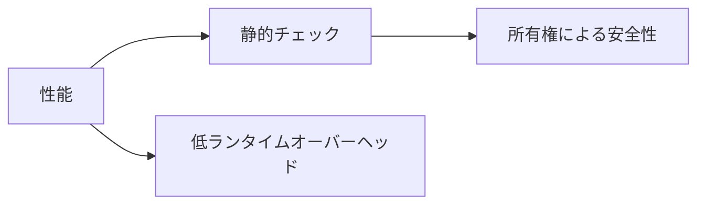

# Rust 01

- [Rust 01](#rust-01)
  - [Overview](#overview)
  - [Key Terms](#key-terms)
  - [Comparison with Other Languages](#comparison-with-other-languages)
  - [Supplementary Figure](#supplementary-figure)

## Overview

Rustはシステムプログラミング用に設計された言語で、**安全性・並行性・性能**を重視します。所有権や借用といった静的解析により、実行時オーバーヘッドを最小化しつつメモリ安全を保証します。

## Key Terms

- 所有権 (Ownership)
- 借用 (Borrowing)
- コンパイル時の安全性

## Comparison with Other Languages

- C/C++: Rustは**Undefined Behavior**をコンパイル時に防ぐことで、安全性を高める。
- GC言語 (Java/Pythonなど): 実行時（ランタイム）に、プログラムが自動でゴミ（不要メモリ）を探して回収する。便利だが、実行速度にわずかな影響が出る。
- Rust: コンパイル時にメモリの寿命を確定させる。実行時のGCが不要なため、C/C++と同等の高速性を維持しつつ、Javaのような安全性も両立している。

## Supplementary Figure

