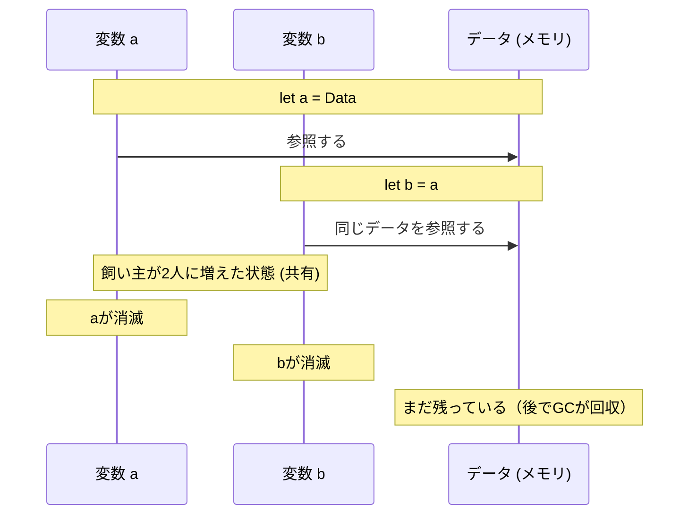
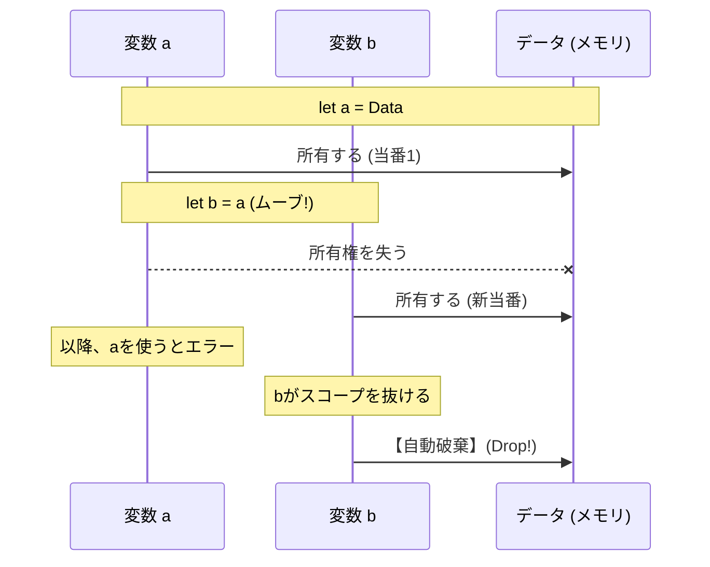
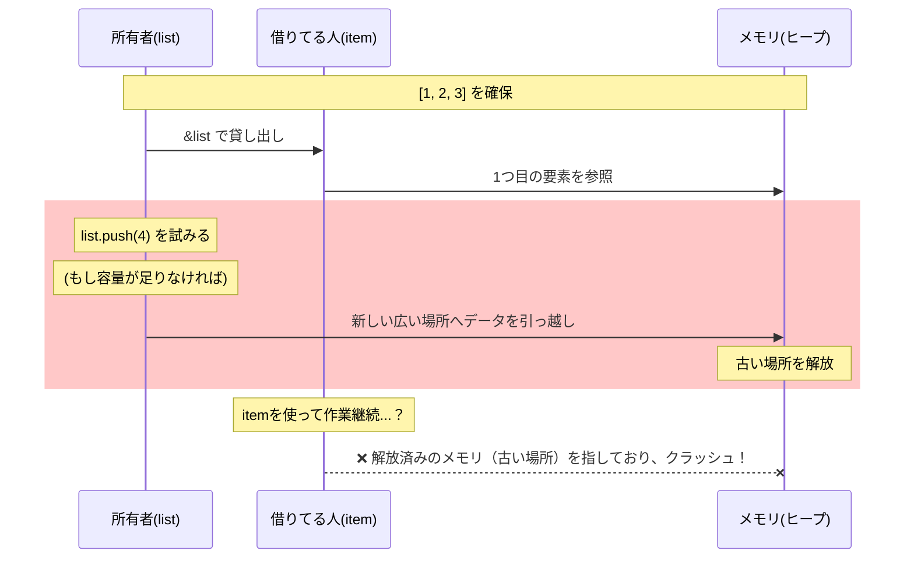
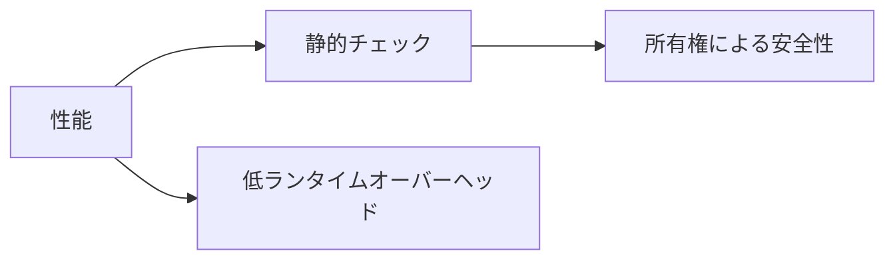

# Rust 01

- [Rust 01](#rust-01)
  - [Overview](#overview)
  - [Key Terms](#key-terms)
  - [Concise Explanation of Terms](#concise-explanation-of-terms)
    - [Ownership](#ownership)
      - [1. The owner is the person responsible for cleaning up the memory.](#1-the-owner-is-the-person-responsible-for-cleaning-up-the-memory)
      - [2. Do other languages have “multiple owners”?](#2-do-other-languages-have-multiple-owners)
      - [Image of Other Languages (GC Languages)](#image-of-other-languages-gc-languages)
      - [Rust Image](#rust-image)
    - [3. Comparing Behavior (Sequence Diagram)](#3-comparing-behavior-sequence-diagram)
      - [Java/Python (Shared Style)](#javapython-shared-style)
      - [Rust (Ownership Transfer Style)](#rust-ownership-transfer-style)
    - [4. Summary of Connections](#4-summary-of-connections)
    - [Borrowing](#borrowing)
      - [1. Basic Rules for Borrowing (Ironclad Rules)](#1-basic-rules-for-borrowing-ironclad-rules)
      - [2. Three Classic Scenarios Where You'll Get Scolded by the Borrower Checker](#2-three-classic-scenarios-where-youll-get-scolded-by-the-borrower-checker)
        - [Pattern 1: “While lending it to someone, trying to lend it to someone else too”](#pattern-1-while-lending-it-to-someone-trying-to-lend-it-to-someone-else-too)
        - [Pattern 2: “While lending it to someone, they try to change it on their own.”](#pattern-2-while-lending-it-to-someone-they-try-to-change-it-on-their-own)
        - [Pattern 3: “The lender disappears first.”](#pattern-3-the-lender-disappears-first)
      - [3. Why is it so strict? (Sequence Diagram)](#3-why-is-it-so-strict-sequence-diagram)
    - [4. What to Do When You Get Scolded](#4-what-to-do-when-you-get-scolded)
  - [Comparison with Other Languages](#comparison-with-other-languages)
  - [Supplementary Figure](#supplementary-figure)

## Overview

Rustはシステムプログラミング用に設計された言語で、**安全性・並行性・性能**を重視します。所有権や借用といった静的解析により、実行時オーバーヘッドを最小化しつつメモリ安全を保証します。

## Key Terms

- 所有権 (Ownership)
- 借用 (Borrowing)
- コンパイル時の安全性

## Concise Explanation of Terms

- **所有権**: 値の所有者を1つに限定し、スコープ終了で自動的に破棄される仕組み。メモリ安全の基礎。
- **借用**: 所有権を移さず参照を渡すことでデータを共有する方法。可変/不変のルールが安全性を保証する。
- **コンパイル時の安全性**: コンパイラが所有権や借用をチェックして多くの実行時バグを防ぐこと。

### Ownership

#### 1. The owner is the person responsible for cleaning up the memory.

Rustの世界では、メモリ（ヒープ領域）にあるデータに対して、**「そのデータを最後にゴミ箱に捨てる権利（と義務）を持っている変数」を1つだけ決めます。これが所有者**です。

- **なぜ1人なのか？**: もし掃除当番が2人いたら、「あいつが掃除しただろう」と思い込んで誰も掃除しなかったり（メモリリーク）、2人が同時にゴミ箱に捨てようとしてケンカ（二重解放：クラッシュの原因）が起きたりするからです。
- **「スコープ終了で破棄」とのつながり**: 「当番がその場を去るとき（スコープ終了）に、必ずゴミを片付ける」という鉄の掟があるため、**当番が1人なら、片付けも必ず1回だけ行われる**ことが保証されます。

#### 2. Do other languages have “multiple owners”?

結論から言うと、**JavaやPythonなどのGC言語は「実質的に所有者が複数いる（あるいは誰が所有者か決まっていない）」状態**です。

#### Image of Other Languages (GC Languages)

複数の変数が1つのデータを「みんなで共有」しています。

- 変数Aも、変数Bも、変数Cも、みんな同じデータを指せます。
- 誰も「自分がいつ捨てるか」を考えません。
- 全員が使い終わった後で、**「第三者（GC）」**がやってきて、「お、これもう誰も使ってないね」と確認して捨ててくれます。

#### Rust Image

データに対して、常に「直属の飼い主（変数）」が1人だけいます。

- 別の変数に渡したいときは、**「譲渡（ムーブ）」**します。
- 譲渡したら、前の飼い主はそのデータに触ることすら許されません。

### 3. Comparing Behavior (Sequence Diagram)

「変数 `a` を `b` に代入したとき」の動きを比べてみましょう。

#### Java/Python (Shared Style)



#### Rust (Ownership Transfer Style)



### 4. Summary of Connections

1. **所有者が1人**: 「誰がメモリを解放するか」が、コンパイル時点で明確に1人に決まる。
2. **ムーブ**: 別の変数に代入すると権利が移り、古い変数は「空っぽ」になる。
3. **スコープ終了で破棄**: 権利を持っている「唯一の変数」が死ぬ瞬間に、確実にメモリを解放できる。

この仕組みのおかげで、Rustは **「GCという掃除屋を雇わなくても、メモリが散らからない」** のです。

「1人しか持てないなら不便じゃない？」と思うかもしれませんが、そこで登場するのが **「借用（一時的に貸すだけ）」** という概念です。次は「貸し借り」の話に進みますか？

### Borrowing

「所有権」が **「譲渡（引越し）」** だとすれば、「借用（Borrowing）」は **「レンタル（貸し出し）」** です。

Rustでは、所有権を動かさずに値を使いたいとき、変数の前に `&` を付けて **「参照（Reference）」** を作成します。これを借用と呼びます。

#### 1. Basic Rules for Borrowing (Ironclad Rules)

借用チェッカー（Borrow Checker）というコンパイラの監視役が、常に以下のルールを見張っています。このルールが、Rustの「データ競合（複数の場所から同時に書き換えて壊れること）」を防いでいます。

**「貸し出し」の2つのモード：**

1. **不変の借用 (`&T`):** 何人でも同時に借りられるが、誰も中身を書き換えられない。
2. **可変の借用 (`&mut T`):** たった一人だけが借りられ、中身を書き換えられる。

**超重要な制限：**
**「可変の借用」をしている間は、他の誰も（元の持ち主ですら！）その値を読んだり書いたりできない。**

#### 2. Three Classic Scenarios Where You'll Get Scolded by the Borrower Checker

初心者が必ず通る「コンパイラとの格闘」の典型例を紹介します。

##### Pattern 1: “While lending it to someone, trying to lend it to someone else too”

（不変参照と可変参照の共存禁止）

```rust
fn main() {
    let mut data = String::from("Hello");

    let r1 = &data;     // 不変の貸し出し（読み取り中）
    let r2 = &mut data; // ❌ ここで怒られる！「誰かが読んでる最中に書き換えられたら困るでしょ」

    println!("{}, {}", r1, r2);
}

```

##### Pattern 2: “While lending it to someone, they try to change it on their own.”

（所有者による直接操作の禁止）

```rust
fn main() {
    let mut list = vec![1, 2, 3];

    for item in &list { // listを不変で貸し出し中
        list.push(4);   // ❌ ここで怒られる！「貸してる最中に勝手に中身を増やすな（メモリの位置が変わるかもだろ）」
    }
}

```

##### Pattern 3: “The lender disappears first.”

（ダングリングポインタの禁止）

```rust
fn dangle() -> &String {
    let s = String::from("hello");
    &s // ❌ ここで怒られる！
} // s はここで破棄される。貸した相手（返り値）は、消えたゴミを指すことになってしまう。

```

#### 3. Why is it so strict? (Sequence Diagram)

パターン②（ループ中の追加）がなぜ危ないのか、メモリの裏側を見てみましょう。



**Rustの借用チェッカーは、この「引っ越し（再確保）」や「書き換え」が起きる可能性をコンパイル時にすべてブロックします。**

### 4. What to Do When You Get Scolded

1. **スコープを分ける:** 使い終わったらすぐ返すように、`{ }` で囲って寿命を短くする。
2. **クローンする:** 貸し借りではなく、`data.clone()` して「自分の分」を新しく作る（速度は少し落ちるが安全）。
3. **設計を見直す:** 「誰がいつまで持っているべきか」を再考する。

Rustを書き始めた頃は、借用チェッカーは「意地悪な上司」に見えますが、慣れてくると **「バグを事前に防いでくれる、最強のデバッグツール」** に変わります。

## Comparison with Other Languages

- C/C++: Rustは**Undefined Behavior**をコンパイル時に防ぐことで、安全性を高める。
- GC言語 (Java/Pythonなど): 実行時（ランタイム）に、プログラムが自動でゴミ（不要メモリ）を探して回収する。便利だが、実行速度にわずかな影響が出る。
- Rust: コンパイル時にメモリの寿命を確定させる。実行時のGCが不要なため、C/C++と同等の高速性を維持しつつ、Javaのような安全性も両立している。

## Supplementary Figure


