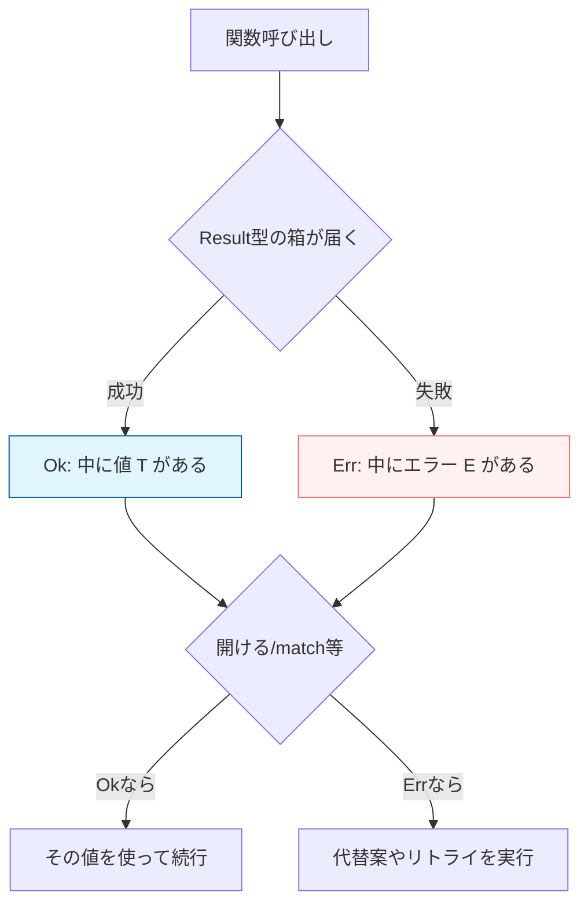
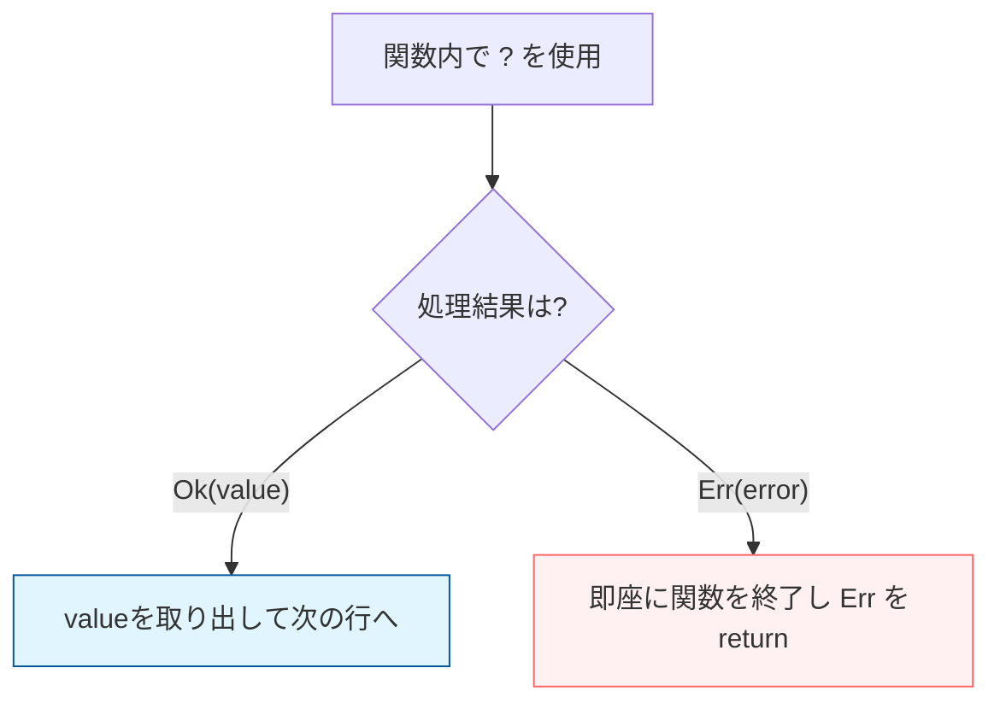

# Rust 08: Error Handling — panic! and Result

- [Rust 08: Error Handling — panic! and Result](#rust-08-error-handling--panic-and-result)
  - [Overview](#overview)
  - [Key Terms](#key-terms)
  - [Concise Explanation: Two Types of Errors](#concise-explanation-two-types-of-errors)
  - [Deep Dive: Recoverable Error Flow](#deep-dive-recoverable-error-flow)
  - [The Propagation Mechanism (`?` Operator)](#the-propagation-mechanism--operator)
  - [Code Example: idiomatic Error Handling](#code-example-idiomatic-error-handling)
  - [Comparison: Exception vs. Result](#comparison-exception-vs-result)

## Overview

Rustは、エラーを「回復不能なもの（panic）」と「回復可能なもの（Result）」に厳密に区別します。多くの言語が採用する `try-catch` 構文は存在せず、代わりに型システムを利用してエラーの処理を強制（網羅）させます。

## Key Terms

- **`panic!`**: 続行不可能な致命的バグ。プログラム（スレッド）を即座に終了させる。
- **`Result<T, E>`**: 成功(`Ok`)か失敗(`Err`)を返す列挙型。
- **`Option<T>`**: 値がある(`Some`)か無い(`None`)かを返す列挙型。
- **`?` 演算子**: エラー処理を簡潔に呼び出し元へ「委譲」するための構文糖衣。

## Concise Explanation: Two Types of Errors

1. **Unrecoverable Error (`panic!`)**:
   - 配列の範囲外アクセスや、絶対に起こり得ないはずの論理破綻。
   - **巻き戻し (Unwinding)**: メモリを掃除しながらプログラムを落とす。
2. **Recoverable Error (`Result<T, E>`)**:
   - 「ファイルが見つからない」など、対処可能なもの。
   - 戻り値そのものが「成功か失敗か」のEnumであるため、必ず中身を確認しなければ値に触れない。

## Deep Dive: Recoverable Error Flow

Rustにおいて、回復可能なエラーを扱うことは「箱を開ける作業」に似ています。



## The Propagation Mechanism (`?` Operator)

`?` 演算子は、この「箱を開ける作業」を極限まで簡略化します。

* **成功時**: 箱から値 `T` を取り出し、そのまま後続の処理へ渡す。
* **失敗時**: 即座に関数を終了し、呼び出し元へエラー `E` を `return` する。



## Code Example: idiomatic Error Handling

```rust
use std::fs::File;
use std::io::{self, Read};

// 戻り値の型に Result を指定。失敗の可能性を「型」として明示する
fn read_username_from_file() -> Result<String, io::Error> {
    let mut s = String::new();

    // ? により「開けられなかったら呼び出し元へエラーを返す」が自動化される
    File::open("hello.txt")?.read_to_string(&mut s)?;

    Ok(s) // 無事に完走したら、Ok で包んで返す
}

```

## Comparison: Exception vs. Result

| 特徴 | 他言語（Java, Python等） | Rust |
| --- | --- | --- |
| **データ構造** | 例外は通常の戻り値とは別ルート。 | `Result` というただの Enum 値。 |
| **安全性の担保** | `catch` を忘れてもビルドが通る。 | 戻り値を無視するとコンパイラに警告される。 |
| **コスト** | 例外発生時のスタックトレース生成が重い。 | 単なる値の return なので、非常に低コスト。 |
