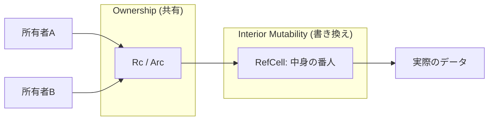

# Rust 11: Smart Pointers (Box / Rc / Arc / RefCell)

- [Rust 11: Smart Pointers (Box / Rc / Arc / RefCell)](#rust-11-smart-pointers-box--rc--arc--refcell)
  - [Overview](#overview)
  - [Key Terms](#key-terms)
  - [Concise Explanation: Why "Smart"?](#concise-explanation-why-smart)
  - [Deep Dive: Reference Counting and Interior Mutability](#deep-dive-reference-counting-and-interior-mutability)
  - [Code Example: Sharing and Mutating (Rc + RefCell)](#code-example-sharing-and-mutating-rc--refcell)
  - [Comparison Table](#comparison-table)

## Overview

スマートポインタは、メモリ上のデータを指し示すだけでなく、メタデータ（参照カウンタなど）や付加機能（自動解放、実行時借用チェック）を持つ構造体です。これらを使うことで、コンパイル時の厳格な所有権ルールでは記述が困難な「データの共有」や「不変構造の中での書き換え」を実現します。

## Key Terms

- **`Box<T>`**: 最もシンプルなポインタ。データをヒープに置き、スタックにはそのアドレスのみを保持する。
- **`Rc<T>` / `Arc<T>**`: 参照カウンタ。複数の場所で「共同所有」する。`Arc`は原子操作（Atomic）を使いスレッド間で安全に共有できる。
- **`RefCell<T>`**: 「内部可変性」を提供。不変参照(`&T`)しか持っていなくても、実行時に借用ルールをチェックして中身を書き換える。
- **Deref / Drop**: スマートポインタを支える2つの重要なトレイト。前者は参照のように扱えるようにし、後者はメモリの自動解放を担う。

## Concise Explanation: Why "Smart"?

通常の参照（`&T`）が単なる「メモリアドレス」なのに対し、スマートポインタは **「データの管理者」** として振る舞います。

- **ヒープへの配置 (`Box`)**: 再帰的なデータ構造（自分自身を中に含む構造体）を定義する際、サイズを確定させるために必須。
- **実行時の借用チェック (`RefCell`)**: 通常、Rustはコンパイル時に「貸出中か」をチェックしますが、`RefCell`はプログラム実行中にチェックを行います。もしルール違反（同時に2人が書き換えるなど）があれば、実行時にパニックします。

## Deep Dive: Reference Counting and Interior Mutability

「共有」と「変更」の両立は、以下の図のように役割を分担して実現します。



## Code Example: Sharing and Mutating (Rc + RefCell)

```rust
use std::rc::Rc;
use std::cell::RefCell;

fn main() {
    // 共有可能で、かつ中身が書き換え可能な値を作成
    let value = Rc::new(RefCell::new(5));

    let a = Rc::clone(&value); // 所有権をコピー（カウンタ増）
    let b = Rc::clone(&value);

    // 内部可変性を使って中身を書き換える
    // .borrow_mut() は実行時に「他に貸し出されていないか」をチェックする
    *value.borrow_mut() += 10;

    println!("Value via a: {:?}", a.borrow()); // 15
    println!("Value via b: {:?}", b.borrow()); // 15
}

```

## Comparison Table

| ポインタ | 所有権 | スレッド間共有 | 実行時コスト | 主な用途 |
| --- | --- | --- | --- | --- |
| **`Box<T>`** | 単独所有 | 可能 | ほぼゼロ | ヒープ確保、再帰構造 |
| **`Rc<T>`** | 共同所有 | 不可 (高速) | 低 (カウンタ操作) | GUIの部品共有、グラフ |
| **`Arc<T>`** | 共同所有 | **可能 (安全)** | 中 (原子操作) | 並行処理でのデータ共有 |
| **`RefCell<T>`** | - | 不可 | 中 (借用チェック) | 不変構造内での状態変更 |
