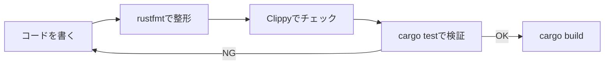

# Rust 15: Testing and Toolchain

- [Rust 15: Testing and Toolchain](#rust-15-testing-and-toolchain)
  - [Overview](#overview)
  - [Key Terms](#key-terms)
  - [The Three Types of Tests](#the-three-types-of-tests)
  - [Concise Explanation: The Development Flow](#concise-explanation-the-development-flow)
  - [Code Example: Unit and Doc Tests](#code-example-unit-and-doc-tests)
  - [Standard Toolchain: The "Rust Way"](#standard-toolchain-the-rust-way)

## Overview

Rustは、テストと品質管理を言語の「標準機能」として組み込んでいます。サードパーティのライブラリを探すことなく、`cargo` ひとつでテストの実行、コードの整形、バグの未然防止（静的解析）が可能です。

## Key Terms

- **`#[cfg(test)]`**: テスト用のコードであることをコンパイラに伝え、通常ビルドから除外する設定。
- **`assert_eq!` / `assert!**`: 値が期待通りかチェックするマクロ。失敗すると `panic!` を起こしテスト失敗となる。
- **Lint (Clippy)**: プログラムの論理的な誤りや、非効率な書き方を指摘するアドバイザー。
- **Formatter (rustfmt)**: 「Rustの公式スタイル」に従ってコードを自動整形するツール。

## The Three Types of Tests

Rustでは、テストを目的別に使い分けます。

| 種類 | 記述場所 | 目的 |
| --- | --- | --- |
| **ユニットテスト** | 各ソースファイル内 | 非公開関数を含む、最小単位のロジック検証 |
| **統合テスト** | `tests/` ディレクトリ | 外部利用者と同じように、公開APIの挙動を検証 |
| **ドキュメントテスト** | ドキュメントコメント内 | サンプルコードが古くなるのを防ぎ、正しさを保証 |

## Concise Explanation: The Development Flow

Rustの開発サイクルは非常にシンプルです。



## Code Example: Unit and Doc Tests

```rust
/// この関数は2つの数値を足します。
///
/// # Examples
/// ```
/// // これが「ドキュメントテスト」になります。
/// let result = my_crate::add(2, 3);
/// assert_eq!(result, 5);
/// ```
pub fn add(a: i32, b: i32) -> i32 {
    a + b
}

#[cfg(test)] // テスト実行時のみコンパイルされる
mod tests {
    use super::*; // 親（上の階層）の関数をインポート

    #[test]
    fn test_add() {
        assert_eq!(add(1, 1), 2);
    }

    #[test]
    #[should_panic] // パニックすることを期待するテスト
    fn test_panic() {
        panic!("意図的な失敗");
    }
}

```

## Standard Toolchain: The "Rust Way"

Rustをインストールすると付いてくる、必携のツール群です。

- **`cargo clippy`**: 「もっとこう書いたほうがRustらしいよ」という1,000種類以上のヒントをくれます。
- **`cargo fmt`**: チーム開発で「波括弧の位置」などの不毛な議論をゼロにします。
- **`cargo doc`**: 自分のプロジェクトと依存ライブラリのドキュメントをHTMLで生成します（ブラウザで閲覧可能）。
- **`cargo-audit`**: 依存しているライブラリに既知の脆弱性がないかスキャンします。
