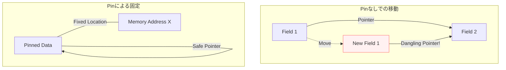

# Rust 16: Advanced Topics

- [Rust 16: Advanced Topics](#rust-16-advanced-topics)
  - [Overview](#overview)
  - [Key Terms](#key-terms)
  - [Concise Explanation: The Boundary of Memory Control](#concise-explanation-the-boundary-of-memory-control)
  - [Visualizing Pin \& Self-Referential Types](#visualizing-pin--self-referential-types)
  - [Brief Description of Pin](#brief-description-of-pin)
  - [Asynchronous Runtime Notes](#asynchronous-runtime-notes)
  - [Object Safety: Traits in Dynamic Dispatch](#object-safety-traits-in-dynamic-dispatch)

## Overview

この章では、Rustのメモリ管理の究極の制御方法である `Pin`、動的ディスパッチを司る「オブジェクトセーフ性」、そして非同期処理の裏側にあるランタイムの仕組みを扱います。これらは「Rustがどう動いているか」の深層部分です。

## Key Terms

- **Pin**: 値のメモリ上の位置を固定（ピン留め）し、移動（Move）を禁止する仕組み。
- **Self-referential Types (自己参照型)**: 自分の構造体内のフィールドを、別のフィールドから参照している特殊な型。
- **Object Safety (オブジェクトセーフ性)**: トレイトを `dyn Trait`（トレイトオブジェクト）として使えるかどうかの制約ルール。
- **Unpin**: ピン留めする必要がない（移動しても安全な）型に自動で付与されるマーカートレイト。

## Concise Explanation: The Boundary of Memory Control

Rustは通常、値を自由に移動（Move）させますが、特定の状況ではこれが致命的なバグを生みます。

1. **自己参照の問題**: 構造体Aの中に「フィールドBへのポインタ」がある場合、構造体Aがメモリ上で移動すると、ポインタが古い住所を指したままになり、不正なアクセスが発生します。
2. **非同期の裏側**: `async` 関数から生成される `Future` は、内部的にこの「自己参照」を多用します。そのため、非同期処理を安全に実行するには `Pin` が不可欠です。

## Visualizing Pin & Self-Referential Types

値が移動（Move）した際に、内部ポインタが壊れる様子とそれを防ぐ `Pin` のイメージです。

## Brief Description of Pin

`Pin
` はポインタ型を包むラッパーです。

- **役割**: 包まれたデータが `Unpin` を実装していない場合、そのデータをメモリ上の特定の場所に「固定」することをコンパイラに保証します。
- **Unpin**: `i32` や `String` など、ほとんどの通常の型は `Unpin` であり、どこへ移動しても安全です。`async` ブロックによって生成される型などは `!Unpin`（Unpinではない）となります。

## Asynchronous Runtime Notes

`async/await` は魔法ではなく、ランタイム（Tokio等）によるオーケストラ演奏です。

- **Reactor**: OS（epoll/kqueueなど）からのI/Oイベントを監視。
- **Executor**: 準備ができたタスク（Future）をスレッドに割り当てる。
- **Polling**: 実行エンジンが `Future::poll()` を呼び出し、処理を1ステップ進める。`Pending` なら一旦中断し、`Ready` になったら再開します。

## Object Safety: Traits in Dynamic Dispatch

トレイトを `dyn Trait` として扱うには、そのトレイトが「オブジェクトセーフ」である必要があります。以下の条件を（一部）満たす必要があります：

- メソッドの戻り値が `Self`（自分自身の具体的な型）ではないこと。
- ジェネリクスなメソッドを持っていないこと。
- **理由**: 実行時に具体的な型が分からない状態（`dyn`）では、型ごとにサイズの異なるジェネリクスなどを処理できないためです。
