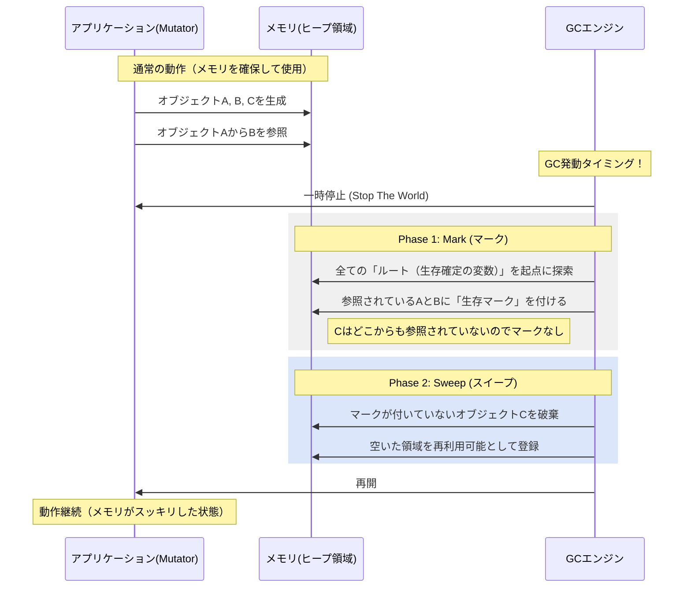
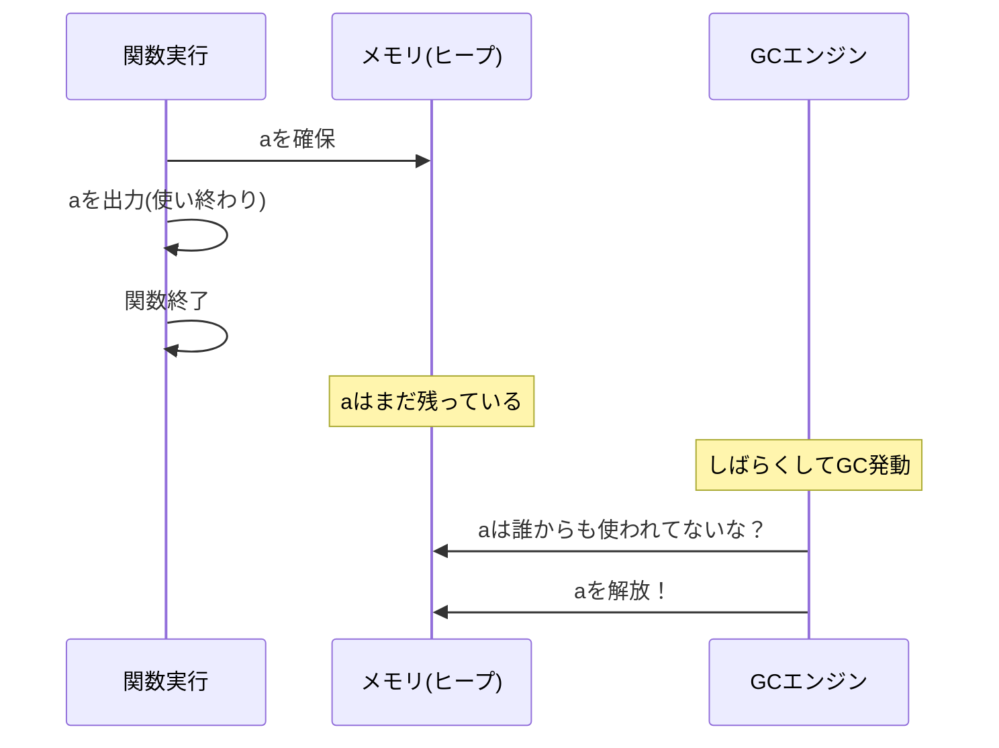
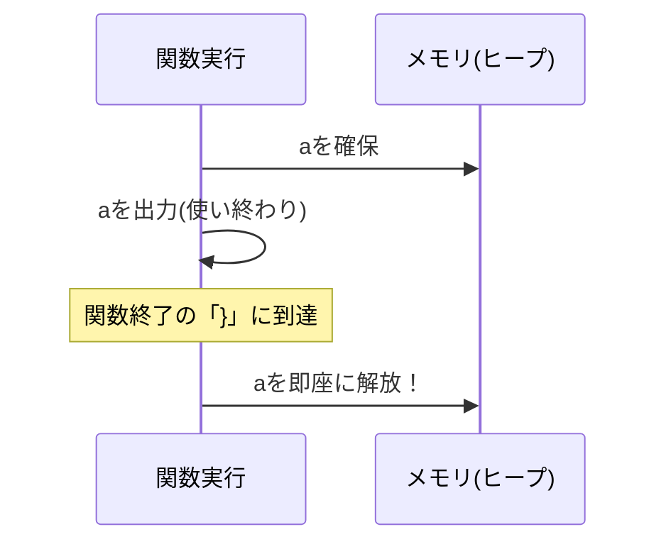

# Rust 01: Additional Notes

- [Rust 01: Additional Notes](#rust-01-additional-notes)
  - [GC (Garbage Collection)](#gc-garbage-collection)
    - [1. What is GC?](#1-what-is-gc)
    - [2. GC Behavior: Sequence](#2-gc-behavior-sequence)
    - [3. Differences Between Cases with and Without GC](#3-differences-between-cases-with-and-without-gc)
      - [1. For GC languages (like Java or Go): “I'll wrap it up later.”](#1-for-gc-languages-like-java-or-go-ill-wrap-it-up-later)
      - [2. In Rust: “The moment it finishes”](#2-in-rust-the-moment-it-finishes)
    - [Key Point: The Trap of “Used Up”](#key-point-the-trap-of-used-up)

## GC (Garbage Collection)

### 1. What is GC?

***「プログラマの代わりに、不要になったメモリ（ゴミ）を見つけ、自動で解放する仕組み」***

本来、コンピュータのメモリ（ヒープ領域）は有限です。データを作った分だけ、使い終わった後に「もう使いません」と宣言（解放）しないと、メモリが不足してパンクしてしまいます（これを**メモリリーク**と呼びます）。

**GCに求められること：**

* **安全性:** まだ使っているデータを間違えて消さない。
* **効率性:** メモリを使い切る前に素早く回収する。
* **透明性:** プログラマが「いつ解放するか」を意識しなくて済むようにする。
* **低遅延:** ゴミ掃除のためにアプリが止まる時間（Stop The World）を最小限にする。

### 2. GC Behavior: Sequence

多くの現代的なGC（JavaやGoなど）で採用されている「マーク＆スイープ（Mark & Sweep）」という方式を例に、その挙動を可視化します。

### 3. Differences Between Cases with and Without GC

| 比較項目 | GCあり (Java/Goなど) | GCなし (C/C++, Rustなど) |
| --- | --- | --- |
| **解放の記述** | 不要（自動） | **手動**（C系）または **コンパイラが自動挿入**（Rust） |
| **実行速度** | GC動作時にわずかな負荷がかかる | GCによる遅延がゼロ（予測可能） |
| **開発の難易度** | 低い（メモリを気にせず書ける） | 高い（寿命の管理を設計する必要がある） |

まさにその通りです。ただ、その「使い終わったから解放していいよね」という判断を、**どのタイミングで、誰が、どうやって下すか**という点に、言語ごとの個性が詰まっています。

結論から言うと、**Java/Go（GC言語）とRust**では、「使い終わった」とみなすタイミングの捉え方が少し違います。

#### 1. For GC languages (like Java or Go): “I'll wrap it up later.”

GC言語では、関数が終わっても **「すぐには」** 解放しません。

* **考え方:** 「プログラマが使い終わったかどうか」よりも、「どこからも辿れなくなったか」を重視します。
* **挙動:**
1. 関数が終了し、変数 `a` への参照がなくなります。
2. この時点ではメモリに残ったままです（ゴミ予備軍）。
3. その後、GCが「そろそろ掃除するか」と動き出した時に、初めて回収されます。

#### 2. In Rust: “The moment it finishes”

Rustは、関数（スコープ）の終わりを **「寿命の終わり」** と厳密に定義しています。

- **考え方:** 「使い終わる場所（スコープの出口）」がコンパイル時にわかっているので、そこに解放命令を予約しておきます。
- **挙動:**
  1. 関数が終了する直前、コンパイラが自動で差し込んだ `drop(a)` が実行されます。
  2. **その瞬間に**メモリが解放されます。

### Key Point: The Trap of “Used Up”

実は、プログラマが「文字出力したから、もうこの変数は使い終わった」と思っていても、GCやコンパイラにとってはそうではないケースがあります。

- **ケースA（まだ生きてる）:** 出力した後に、その変数 `a` を別のリストに入れたり、関数の戻り値として返したりした場合。
- **ケースB（Rust特有）:** Rustでは、出力（`println!`）に `a` を渡しても、所有権を貸している（借用）だけなら `a` はまだ生きています。もし `a` 自体を別の関数に「ムーブ」させたら、出力が終わる前でも `a` はそこ（呼び出し元）からは消えてしまいます。
