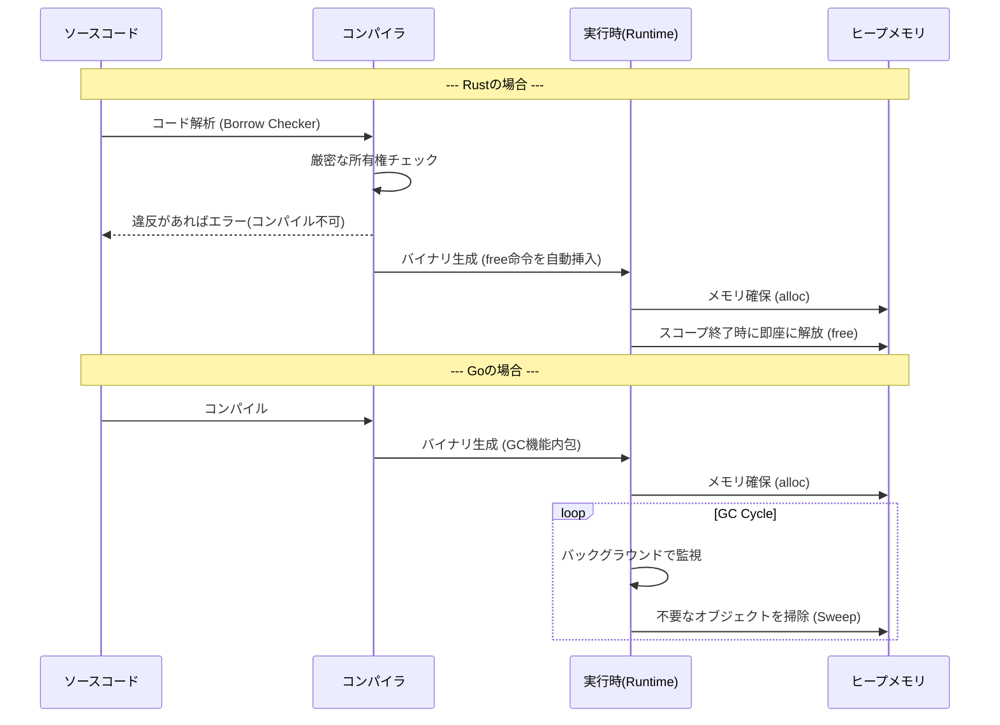
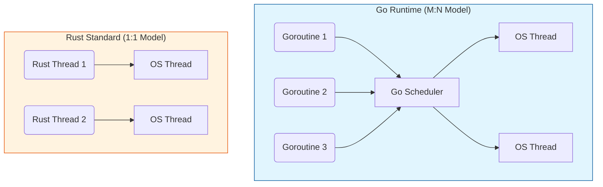

# Rust vs Go: 技術的アプローチの比較と選定ガイド

- [Rust vs Go: 技術的アプローチの比較と選定ガイド](#rust-vs-go-技術的アプローチの比較と選定ガイド)
  - [1. 概要：設計思想の違い](#1-概要設計思想の違い)
  - [2. メモリ管理モデルの比較](#2-メモリ管理モデルの比較)
    - [Go: ガベージコレクション (GC)](#go-ガベージコレクション-gc)
    - [Rust: 所有権と借用 (Ownership \& Borrowing)](#rust-所有権と借用-ownership--borrowing)
      - [メモリ管理のライフサイクル](#メモリ管理のライフサイクル)
  - [3. 並行処理 (Concurrency)](#3-並行処理-concurrency)
    - [Go: Goroutine \& Channels (CSPモデル)](#go-goroutine--channels-cspモデル)
    - [Rust: Thread \& Ownership](#rust-thread--ownership)
      - [スレッドモデルの比較](#スレッドモデルの比較)
  - [4. エラーハンドリングと型システム](#4-エラーハンドリングと型システム)
    - [Rust: 代数的データ型 (Result/Option)](#rust-代数的データ型-resultoption)
    - [Go: 多値戻り値とエラーチェック](#go-多値戻り値とエラーチェック)
  - [5. パフォーマンスとランタイム](#5-パフォーマンスとランタイム)
  - [6. どちらを学ぶべきか？](#6-どちらを学ぶべきか)
    - [Rust を選ぶべきケース](#rust-を選ぶべきケース)
    - [Go を選ぶべきケース](#go-を選ぶべきケース)
    - [結論](#結論)

## 1. 概要：設計思想の違い

| 特徴 | **Rust** | **Go (Golang)** |
| --- | --- | --- |
| **主な目的** | **メモリ安全性とゼロコスト抽象化** | **シンプルさと開発のスケーラビリティ** |
| **キャッチコピー** | "Reliability & Performance" (信頼性と性能) | "Simplicity & Concurrency" (単純さと並行性) |
| **メンタルモデル** | **C++の正当な後継**<br>(複雑だが最強の制御力) | **Cの現代版 + Pythonの生産性**<br>(実用的で読みやすい) |
| **ガベージコレクション** | **なし** (コンパイル時管理) | **あり** (実行時管理) |
| **学習曲線** | 急峻 (所有権の理解が必要) | 平坦 (週末で基本を習得可能) |

## 2. メモリ管理モデルの比較

最も重要な技術的差異はここです。

### Go: ガベージコレクション (GC)

Goは実行時（Runtime）に不要なメモリを自動回収します。

- **メリット**: メモリ管理を意識せずビジネスロジックに集中できる。
- **デメリット**: GC実行時に「Stop the World」（極短時間の停止）が発生する可能性があり、リアルタイム性が求められる制御系には不向き。

### Rust: 所有権と借用 (Ownership & Borrowing)

Rustはコンパイル時にメモリ解放位置を決定します。

- **メリット**: **実行時オーバーヘッドがゼロ**。メモリ使用量が予測可能で最小限。
- **デメリット**: コンパイルを通すために、メモリの寿命（ライフタイム）を厳密に意識する必要がある。

#### メモリ管理のライフサイクル



## 3. 並行処理 (Concurrency)

モデルどちらも並行処理が得意ですが、アプローチが異なります。

### Go: Goroutine & Channels (CSPモデル)

- **Goroutine**: OSスレッドよりもはるかに軽量な「グリーンスレッド」。数千、数万個を生成してもメモリを食いません。GoランタイムがOSスレッドへ多対多（M:N）でスケジューリングします。
- **思想**: 「メモリを共有して通信するな、通信（Channel）によってメモリを共有せよ」

### Rust: Thread & Ownership

- **OSスレッド**: 標準ライブラリは1:1のOSスレッドを使用（重いが、OSの機能をフル活用可能）。
- **Async/Await**: 非同期ランタイム（Tokioなど）を使えば、Goのような軽量スレッドも可能。
- **安全性**: 所有権システムにより、**データ競合（Data Race）をコンパイル時に防ぐ**「恐れのない並行性 (Fearless Concurrency)」を提供。

#### スレッドモデルの比較



## 4. エラーハンドリングと型システム

### Rust: 代数的データ型 (Result/Option)

関数型言語の影響を強く受けています。

- **例外なし**: `Result<T, E>` 型を返すことでエラー処理を強制。
- **ヌル安全**: `null` (nil) が存在せず、値がない場合は `Option<T>` (`None`) を使う。
- **ジェネリクス**: 強力でゼロコスト。

```rust
// Rust: Result型とパターンマッチング
fn divide(a: f64, b: f64) -> Result<f64, String> {
    if b == 0.0 { Err("Division by zero".to_string()) } else { Ok(a / b) }
}

```

### Go: 多値戻り値とエラーチェック

手続き型言語のシンプルさを重視。

- **明示的チェック**: エラーは単なる値として返される。
- **Nil**: ポインタやインターフェースにおいて `nil` が存在し、実行時パニックの原因になりうる（ヌル安全ではない）。
- **ジェネリクス**: Go 1.18で導入されたが、Rustほど複雑なことはできない。

```go
// Go: 多値戻り値とnilチェック
func divide(a, b float64) (float64, error) {
    if b == 0.0 { return 0.0, fmt.Errorf("division by zero") }
    return a / b, nil
}

```

## 5. パフォーマンスとランタイム

| 項目 | **Rust** | **Go** |
| --- | --- | --- |
| **実行速度** | **C/C++と同等**。最速クラス。 | 非常に高速だが、GCとランタイムの分だけRust/C++に劣る。 |
| **バイナリサイズ** | 静的リンク時は中程度。不要コード削除が強力。 | ランタイムを含むため、Hello Worldでも少し大きくなる。 |
| **起動時間** | 一瞬。 | 非常に速い（Java JVM等に比べれば一瞬）。 |
| **メモリフットプリント** | 極小。制御可能。 | GC用のヒープ管理オーバーヘッドがある。 |

## 6. どちらを学ぶべきか？

### Rust を選ぶべきケース

- **OS、デバイスドライバ、組込みシステム**を作りたい（GCが許されない環境）。
- **WebAssembly (Wasm)** でブラウザ上で重い計算をさせたい。
- メモリレイアウトやポインタの仕組みなど、**計算機の低レイヤーを深く理解したい**。
- バグが許されない、堅牢性が最優先されるシステムを作りたい。

### Go を選ぶべきケース

- **Webサーバー、APIサーバー、マイクロサービス**をサクッと作りたい。
- ネットワークプログラミング（クラウド基盤ツールなど）を書きたい（DockerやKubernetesはGo製）。
- チーム開発で、誰が書いても同じような読みやすいコードにしたい。
- 低レイヤーの複雑さよりも、**開発速度（生産性）**を優先したい。

### 結論

- **「計算機科学的な正しさ・安全性・極限の性能」** に興味があるなら **Rust**
- **「実用的なWebサービス開発・クラウドインフラ・並行処理」** に興味があるなら **Go**。

両方とも現代のソフトウェア工学において極めて重要な言語です。Rustで低レイヤーの原理を学び、Goでサーバーサイドの実践力を身につけるというルートも非常に有効です。
